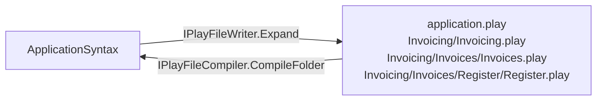

# Folders

A `.play` file describes an application. That works beautifully right up until the application gets big - the invoicing sample in this repository is a single file of nine hundred lines, and it only has one module. Put five modules in it and nobody can find anything, two people cannot touch it at once, and a diff stops telling you what changed.

The structure you want is already in the language. Modules contain features, features contain slices - so let the file system hold that shape, one folder per level, and let the compiler put it back together. That is what this page is about: a folder of `.play` files is **one application**, in both directions.



## Compile a folder as one application

`CompileFolder` discovers every `.play` file beneath a folder, merges them into the one application they describe, and resolves the whole:

```csharp
using Cratis.Screenplay.Files;

var compilation = new PlayFileCompiler().CompileFolder(root);

if (compilation.Result.Success)
{
    var application = compilation.Result.Value!;
}
```

The merge happens *before* anything is resolved, and that is the entire point. An event declared in one file and produced in another resolves. A concept declared once at the root is available to every slice. A policy an `authorize` names is found wherever it lives.

Compare that with [`CompileIn`](tool.md#use-the-compiler-as-a-library), which compiles every file as a document in its own right. Given a folder where `Register.play` declares `InvoiceRegistered` and `Submit.play` produces it, `CompileIn` reports:

```text
Submit.play(5,9): warning PLAY0165: Unknown type 'InvoiceId' on 'invoiceId' of command 'Submit' - declare it with 'concept InvoiceId : <Primitive>' or 'type InvoiceId'
Submit.play(6,9): warning PLAY0167: Unknown policy 'CanManageInvoice' - declare it with 'policy CanManageInvoice'
Submit.play(7,9): warning PLAY0166: Unknown event 'InvoiceRegistered' - declare it with 'event InvoiceRegistered'
```

None of those are real. `CompileFolder` reports nothing, because none of them are missing - they are just in another file. Both calls remain available: reach for `CompileIn` only when the files genuinely are separate documents that happen to share a folder.

### Diagnostics know which file they came from

A single document needs no file identity - there is one source text, and you handed it over. A folder does, so every `SourceLocation` in a folder compilation carries the relative path of the file it came from:

```csharp
foreach (var diagnostic in compilation.Result.Diagnostics)
{
    Console.WriteLine($"{diagnostic.Location.Path}({diagnostic.Location.Line},{diagnostic.Location.Column}): {diagnostic.Message}");
}
```

A location carries a path exactly when the compiler was told one. `ScreenplayCompiler.Compile` is never told one, so `Path` stays `null` there and nothing about compiling a single document changed. The compilation also hands back the source text of every file it read, in `Sources`, so a diagnostic can be rendered with its offending line by [the formatter](tool.md#verify-your-files):

```csharp
var sources = compilation.Sources.ToDictionary(source => source.File.RelativePath, source => source.Source);
var formatter = new DiagnosticFormatter();

foreach (var diagnostic in compilation.Result.Diagnostics)
{
    var file = diagnostic.Location.Path!;
    Console.WriteLine(formatter.Format(file, diagnostic, sources[file], useColors: true));
}
```

### Drive a visitor over the folder

Consumers do not usually want the syntax tree - they want their own representation of it, which is what [the visitors and the walker](visitors.md) are for. Both the folder and the single file have a visitor overload, so a consumer takes one path regardless of how the application arrived:

```csharp
var compiler = new PlayFileCompiler();

var fromFolder = compiler.CompileFolder(root, new MyApplicationVisitor());
var fromFile = compiler.CompileFile(path, new MyApplicationVisitor());
```

Both return an `ApplicationCompilation<T>` carrying the visitor's result and the diagnostics. The visitor sees the merged application - one tree, whatever it was spread across - and runs only when the compilation had no errors.

### The CLI does this too

`screenplay <folder>` verifies the folder as one application. `screenplay <file>` still verifies that one file on its own, which is what you want when a generator just produced it:

```bash
screenplay path/to/screenplays          # the folder, as one application
screenplay path/to/invoicing.play       # that file, on its own
```

## Write an application out as a folder

The inverse lives next to it. `Expand` turns an application into the files of a folder structure without touching the file system, and `WriteTo` puts them on disk:

```csharp
using Cratis.Screenplay.Files;

var writer = new PlayFileWriter();

foreach (var file in writer.Expand(application))
{
    Console.WriteLine(file.RelativePath);   // and file.Content
}

writer.WriteTo(application, root);
```

`Expand` hands the files back rather than writing them, so the same structure can go to disk, into an archive, or straight down a wire without the expansion knowing which. `WriteTo` creates every folder it needs and overwrites the files it names - it leaves anything else beneath the root alone, so a removed slice leaves its file behind. Clear the folder first when the structure must be exactly what the application says.

### What lands where

Every level of the language gets a folder, and the file inside a folder carries that level's own content:

```text
application.play                                    domain, imports, concepts, types,
                                                    policies, personas, authentication, seed
Invoicing/
  Invoicing.play                                    module Invoicing - description and layouts
  Invoices/
    Invoices.play                                   feature Invoices - description
    Register/
      Register.play                                 slice StateChange Register
    Submit/
      Submit.play                                   slice StateChange Submit
    Archiving/
      Archiving.play                                nested feature Archiving - description
      Archive/
        Archive.play                                slice StateChange Archive
```

| File | Holds |
|---|---|
| `application.play` | Everything that belongs to the application as a whole rather than to any one module: `domain`, `import`, `concept`, `type`, `policy`, `persona`, `authentication` and `seed`. There is one, always, at the root. |
| `<Module>/<Module>.play` | The module's own `description` and its `layout` declarations - not its features. |
| `<Module>/…/<Feature>/<Feature>.play` | The feature's own `description` - not its slices or sub features. |
| `<Module>/…/<Feature>/<Slice>/<Slice>.play` | One slice, whole. |

Every one of those is a complete `.play` document. A slice file restates the module and feature it belongs to, because that is what the language needs in order to place a slice:

```screenplay
module Invoicing
  feature Invoices
    slice StateChange Register
      event InvoiceRegistered
        invoiceId InvoiceId
```

Nothing is written twice. The restated `module Invoicing` in a slice file carries no description and no layouts - those live in the module's own file - so there is never a second copy of anything to fall out of sync.

## How the files become one application

Merging follows a single rule: **the documents of a folder are one document**. From that everything else follows.

| Declaration | What the merge does |
|---|---|
| `module`, `feature` | **Combined by name.** Every file naming `module Invoicing` is talking about the same module. This is what lets a slice live in its own file and still belong to its feature. |
| `slice`, `layout` | Accumulated. A second file declaring one that already exists is an error. |
| `concept`, `type`, `policy`, `persona` | Accumulated. Concepts and types share one namespace, so a `type` cannot take a `concept`'s name. A second file declaring one that already exists is an error. |
| `domain`, `authentication` | At most one for the whole folder. A second file declaring one is an error. |
| `import` | Merged and de-duplicated. An import declared anywhere applies to the whole application, exactly as it does within a single document. |
| `seed` | Accumulated, the same way multiple `seed` blocks accumulate within one document. |
| `description` on a module or feature | The first one given wins. A second, different one is a warning - only the file that owns the folder is expected to describe it. |

A duplicate is reported **only when the same name is declared in more than one file**, and it always names both ends - the file the name was already claimed in, and the location of the file that tried to claim it again:

```text
second.play(1,1): error PLAY0173: Duplicate declaration of 'InvoiceId' - already declared in 'first.play'
second.play(3,5): error PLAY0173: Duplicate slice 'Register' in feature 'Invoices' - already declared in 'first.play'
second.play(1,1): error PLAY0172: The folder already declares a domain in 'first.play' - a folder compiles to one application, which can have at most one
```

Duplicates *within* one file are left to the single document compiler, which already has its own rules for them. Compiling one document behaves exactly as it always has.

### Why `import` still means what it meant

`import` names something that comes from outside the application - another bounded context, another team's contract. It does not resolve against another file of the same folder, and it does not need to: the files of a folder are one document, so a name declared in one of them is simply in scope in all of them. Adding an import for a name your own application declares would say the opposite of what is true.

## Round-tripping

Writing a folder and compiling it back gives an equivalent application. The invoicing sample - which exercises the whole language - is the gate on that: it expands to twenty-one files, compiles back with no diagnostics, and expanding the result again produces exactly the same twenty-one files, byte for byte.

One thing does not survive, and it cannot: **declaration order**. A file system has paths, not order, so modules, features and slices come back sorted by name rather than in the order they were authored. Everything within a slice - its events, commands, projections, mappings, code blocks, descriptions - comes back exactly as it went in, because it never left its file.

## When a folder is the wrong fit

- **A small model.** One file you can read top to bottom beats eleven folders. Reach for a folder when the single file stops being navigable, not before.
- **Something generated end to end.** If a tool produces the document and nothing hand-edits it, the structure buys you nothing - print it with [the printer](printing.md) and write one file.
- **Several unrelated applications in one folder.** `CompileFolder` will merge them, because it has no way to know they are not one application. Give each its own folder.
- **Names a file system cannot tell apart.** Two declarations at the same level whose names differ only in casing have nowhere separate to live, and expansion throws `AmbiguousPlayFilePath` rather than silently losing one.

## See also

- [Compiler and CLI](tool.md) - compiling, diagnostics, and the command line tool.
- [Printing and generating](printing.md) - the whole application as one document.
- [Modules, features and slices](slices.md) - the structure the folders mirror.
