Screenplay-family integrations move in two independent directions: authored source can be recovered into Screenplay, and Screenplay can be compiled and realized as target artifacts. Syntax-tree tools sit beside both directions when they only need to inspect or export the written language.

Choose the narrowest extension level that owns the decision you need to make. This keeps source-framework interpretation out of Screenplay, target realization out of Generation, and orchestration out of render planners.

## Two-direction architecture

```mermaid
flowchart LR
    Source[Authored source] --> SourceHost[Source host]
    SourceHost --> Adapter[IDotNetScreenplayAdapter]
    Adapter --> Facts[Neutral facts and diagnostics]
    Facts --> Generation[Generation resolve, lower, print, and verify]
    Generation --> Play[Canonical Screenplay]

    Play --> Compiler[SemanticModelCompiler]
    Compiler --> ESM[Executable semantic model]
    ESM --> Execution[SemanticExecutionPlan]
    Execution --> Planner[IArtifactRenderPlanner]
    Planner --> Plan[ArtifactRenderPlan]
    Plan --> Publisher[Orchestrator and managed publisher]
    Publisher --> Artifacts[Target artifacts]

    Play -. syntax tree .-> Walker[ScreenplaySyntaxWalker]
    Walker -. inspect or export .-> SyntaxTool[Syntax tool]
```

The two main directions are not inverses:

- A source adapter explains what authored source proves and reports what it cannot recover.
- A render planner makes explicit, versioned choices for one target and rejects semantics it cannot realize.

Recovering generated artifacts through a source adapter can provide a useful regression check, but it does not prove behavioral equivalence or a lossless round trip.

## Level 1: syntax tools and exporters

Use `ScreenplaySyntaxWalker` when the integration consumes Screenplay syntax directly: documentation tools, linters, indexes, visualizers, format-aware exporters, and other tree analyses.

The type ships in the `Cratis.Screenplay` package under `Cratis.Screenplay.Syntax`. Its general and root entry points are:

| Member | Purpose |
| --- | --- |
| `public virtual void VisitNode(SyntaxNode node)` | Observe every node before node-specific traversal |
| `public virtual void VisitApplication(ApplicationSyntax syntax)` | Walk a complete application |
| `public virtual void VisitProjection(ProjectionSyntax syntax)` | Walk a standalone projection |
| `public virtual void VisitSpecification(SpecificationSyntax syntax)` | Walk a standalone specification |
| `public virtual void VisitCapture(CaptureSyntax syntax)` | Walk a standalone capture |

Every concrete node kind also has a public virtual `Visit...` method. The walk is pre-order: `VisitNode()` runs before the node-specific method descends into children. An override that calls its `base` implementation continues into that subtree; an override that does not call `base` prunes it.

This is the compatibility-oriented extension point for syntax consumers. It is not the source-recovery contract and it is not the target-rendering contract. A generator that must make decisions from resolved semantic identity should consume the executable semantic model through a render planner instead of inferring meaning from syntax names.

See [Visitors and traversal](visitors.md) and [Syntax tree compatibility](ast-compatibility.md) for traversal and versioning details.

## Level 2: source-to-Screenplay recovery

Use `IDotNetScreenplayAdapter` when an integration recovers authored .NET source into Screenplay. The adapter interprets framework or library evidence in Roslyn compilations and contributes neutral facts, evidence, and diagnostics.

The contract ships in `Cratis.Screenplay.Generation.DotNet` under `Cratis.Screenplay.Generation.DotNet`:

| Member | Contract |
| --- | --- |
| `AdapterIdentity Identity { get; }` | Stable adapter identity and version |
| `bool CanAnalyze(DotNetAnalysisContext context)` | Whether the adapter recognizes evidence it can analyze |
| `AdapterContribution Analyze(DotNetAnalysisContext context, DotNetAdapterOptions options)` | Neutral facts and diagnostics from one analysis |

The surrounding host owns workspace loading, the authoritative authored syntax trees, options, and explicit adapter selection. `CanAnalyze()` decides whether an already-selected adapter recognizes semantic evidence in that context. `Analyze()` returns one `AdapterContribution`; it does not construct syntax or print `.play` text.

Generation owns the framework-neutral pipeline after analysis. `ScreenplayDefinitionGenerator.Generate(...)` resolves all contributions together, lowers the resolved graph to Screenplay syntax, prints canonical source, and verifies that source with the Screenplay compiler.

Generation does not discover adapter packages automatically. A package, catalog entry, or implementation of the interface does not make an adapter active; a host must select and compose it.

For implementation details, source authority, evidence strength, deterministic identity, diagnostics, and verification, follow the canonical [Generation source adapter guide](/screenplay/generation/guides/build-source-adapter/).

## Level 3: Screenplay-to-artifact rendering

Use `IArtifactRenderPlanner` when an integration turns compiled Screenplay semantics into target artifacts. Raw `.play` input is compiled first; the planner receives an immutable executable semantic model and its capability-admitted execution plan.

The contract ships in `Cratis.Stage.Contracts` under `Cratis.Stage.Contracts.Rendering`. Its public operation is `ArtifactRenderPlan Plan(ArtifactRenderRequest request)`.

`ArtifactRenderRequest` is a sealed record with this exact positional contract:

| Parameter | Type | Purpose |
| --- | --- | --- |
| `Model` | `ExecutableSemanticModel` | Immutable executable semantic model |
| `ExecutionPlan` | `SemanticExecutionPlan` | Capability-admitted plan for that model |
| `Profile` | `ArtifactRenderProfile` | Fully resolved target and renderer profile |
| `Scope` | `ArtifactRenderScope` | Semantic scope to render |

A scope identifies the application, one module, one feature, or one slice. The fully resolved profile identifies the target, renderer, versions, and immutable inputs.

### Executable semantic model versions

Screenplay writes a model as language/semantic `1.0` and canonical JSON `schemaVersion: 1` unless the model uses a v2 construct. A typed command destination from `produces … for` **without duplicating the identity in the event payload**, a specification event-source `for` assertion, or an admitted scalar `$context` value in `produces` selects language/semantic `2.0` and `schemaVersion: 2`. The strict reader accepts these paired versions; v1 canonical bytes and revisions do not change. Historical v1 sources that already used `produces … for` while copying the same identifier into event payloads keep their v1 contract; v2 models promote the typed command destination independently of that legacy payload. A target pinned to v1, including Stage until it explicitly bumps its ESM admission, must reject v2 rather than treating the new context and destination as payload or ignoring them. See [Specifications](specifications.md) and [Contexts](context.md) for the admitted syntax.

An implementation attachment admitted by the ESM (a bodied reducer transition, code validation, or policy predicate) selects language/semantic `3.0` and `schemaVersion: 3`; v3 includes all v2 semantics, including typed command destination promotion, and sources without a v3 construct retain their v1/v2 bytes and revisions. Its ESM reducer entry names the built read model, observed event contracts, event-source key, null initial state, state-or-delete result, and each rule's implementation requirement id. The body is not portable executable code. Screenplay names the `pure` capability; a target provider owns the allowlist and must reject code it cannot admit. An unresolved file attachment has no content hash until its host supplies contents; the authored path never serves as its revision. Rule predicates on command properties and concepts bind their guarded value, name, message, severity and requirement id; whole-command code validation binds ordered requirement ids and yields zero or more rejection messages. These attachments require context/result contract version 1 and capability `pure`. An opaque policy's `condition` is `{"kind":"opaque"}` with a `requirementId` on its policy entry; portable policy entries retain their v1/v2 bytes. The documented `RuleContext` supplies the value and, for a command predicate, the command artifact; a predicate returns accept or reject. A strict v1/v2 consumer must reject v3 explicitly. A specification that reads reducer-built state gets `SemanticUnsupported` naming the reducer rather than synthesized reducer state. An executed command that carries code validation, including through nested or collection concepts, gets `SemanticUnsupported` naming the rule rather than a guessed validation result. A command or query whose authorization depends on an opaque policy returns `SemanticUnsupported` with the Authorization capability and the policy name rather than claiming a denial or permission. In authored order, a portable left-hand `and` denial or `or` allowance short-circuits; an opaque operand reached first makes the result unsupported even if a later operand could decide it (see [decision 0001](https://github.com/Cratis/Screenplay/blob/main/decisions/0001-chronicle-runtime-semantic-authority.md) and [Policies](policies.md#portable-evaluation)). Unrelated specifications remain runnable.

An event with multiple declared generations selects ESM language/semantic `4.0` and `schemaVersion: 4`, including when the same document uses v2 destinations or v3 attachments. A lone generation-1 marker does not select v4. Only evolved event records carry `predecessor` and `priorRevisions`; ordinary single-generation events in a v4 model omit both fields. Preceding revisions appear in numeric order, with revision-specific property identities and tags. History changes canonical bytes and `SemanticRevision`. In v4, flat projection transitions carry no affected-instance `cardinality`: they always affect one instance. A v4 model carrying `zeroOrOne` or `many` there is invalid; v1–v3 bytes and query cardinality are unchanged. The strict reader rejects noncanonical versions/bytes and revision mismatches. Deployment to Chronicle requires an admitted transformation chain; a target lacking one must reject evolution, never guess a conversion. See [Events](events.md) and [decision 0015](https://github.com/Cratis/Screenplay/blob/main/decisions/0015-event-generations-in-the-executable-model.md).

The planner owns target admission and realization. It returns a complete deterministic `ArtifactRenderPlan` with planned paths, bytes, hashes, and typed diagnostics. It must not write files, start processes, use the network, read the clock, or inspect ambient dependency state. Publication belongs to the caller after a successful plan.

A target must fail closed when it cannot realize reachable semantics. It must not emit guessed defaults, thinner behavior, placeholders, or `to-do` blocks.

### Canonical conformance corpus

`Cratis.Screenplay.CanonicalCorpus` provides source-backed vectors for consumers that compile Screenplay independently of their rendering pipeline. `RegisterProjectCorpus.LegacyV1` contains single-file, folder, reverse-ordered, and relocated forms of the same application. Each form carries exact UTF-8 bytes, stable document keys, portable display paths, and identity-catalog bytes; all compile to the pinned semantic revision, canonical ESM bytes, and normalized specification outcomes. A relocated path changes the workspace transport revision, **not** the semantic revision.

`RegisterProjectCorpus.V2` names the evolved *scenario*, not the ESM schema. It pins new ESM v4 bytes and revision: generation 1 of `ProjectRegistered` carries `projectId` and `name`, while generation 2 carries only `name`; the command and expected event specify the stream with `for`, and the projection keys from the event source. The single-file and folder forms have distinct persisted catalogs; reordered and relocated forms reuse the folder catalog. All four produce the same bytes, identities and outcomes. Consumers pinned to v1–v3 must reject this v4 vector. The identity catalog retains `schemaVersion: 1` while its typed property addresses can now include a `Generation` part and its event assignments can carry revisions above 1. Readers without support for those address parts must reject the catalog rather than drop lineage. The legacy v1 corpus and v1–v3 serializer golden bytes remain unchanged. `Semantics/Serialization/Golden/full-esm-v4.json` is the source-backed mixed v4 serializer vector.

`RegisterProjectCorpus.UnsupportedSequence` is a `CanonicalCorpusRejectionVector`: compilation returns no ESM, its expected `PLAY0268` diagnostic is explicit, and `ArtifactPaths` is empty. Treat failed binding as zero publishable artifacts; an empty manifest alone is not evidence that a renderer ran. These vectors are conformance inputs, not renderer plans or a CLI activation policy.

For profiles, admission, deterministic planning, scope behavior, publication boundaries, and verification, follow the canonical [Stage renderer target guide](/screenplay/stage/guides/build-renderer-target/).

## Ownership boundaries

| Owner | Semantic responsibility | Does not own |
| --- | --- | --- |
| Screenplay | The language, syntax tree, compiler, printer, semantic identities, executable semantic model, and portable execution plan | Source-framework interpretation, target-specific realization, or CLI admission |
| Generation adapters | Interpretation of authored source into neutral facts, evidence, and diagnostics | Workspace authority, Screenplay language semantics, syntax printing, or target artifacts |
| Generation core | Deterministic resolution, lowering, canonical printing, and compiler verification across adapter contributions | Adapter discovery or framework-specific source interpretation |
| Stage renderers | Target capability admission and pure, deterministic artifact planning from the executable semantic model | Source recovery, file publication, process execution, or CLI command policy |
| CLI orchestration | Command-line selection, fully resolved profiles, planner invocation, diagnostics, staging, and publication | Screenplay semantics or target realization rules |

The source-recovery host and the rendering CLI are composition boundaries. They decide which trusted integrations to invoke; implementing an extension contract does not grant that trust.

## Neutral extension catalog

An extension catalog describes interoperability options. It is documentation, not a plugin loader, package-discovery mechanism, trust decision, compatibility guarantee, or CLI allowlist.

| Extension level | Public entry point | Input | Output | Activation model |
| --- | --- | --- | --- | --- |
| Syntax consumer | `ScreenplaySyntaxWalker` | Screenplay syntax root or subtree | Consumer-defined analysis or export | The consuming tool constructs and invokes its walker |
| .NET source recovery | `IDotNetScreenplayAdapter` | `DotNetAnalysisContext` and `DotNetAdapterOptions` | `AdapterContribution` | A source host explicitly selects and composes adapters |
| Target rendering | `IArtifactRenderPlanner` | `ArtifactRenderRequest` | `ArtifactRenderPlan` | A caller explicitly constructs the planner and profile; a CLI may separately bundle a reviewed target |

Clearly labeled ecosystem examples include the Vogen source adapter in Screenplay Generation, the [Critter Stack source adapter](/screenplay/ecosystem-examples/critter-stack/) as a framework-specific integration, and the Cratis artifact render planner in Stage. Ecosystem-specific adapters and renderers are owned separately from the core extension contracts. Catalog membership documents an integration; it does not imply admission to or support by the Cratis CLI.

The Cratis CLI currently uses a static, reviewed renderer-target roster. A renderer appearing in this catalog, being installed beside a workspace, or implementing `IArtifactRenderPlanner` does not admit it to that roster. CLI support requires a separate orchestration change, explicit profile construction, publication wiring, and verification.
