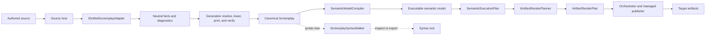

Screenplay-family integrations move in two independent directions: authored source can be recovered into Screenplay, and Screenplay can be compiled and realized as target artifacts. Syntax-tree tools sit beside both directions when they only need to inspect or export the written language.

Choose the narrowest extension level that owns the decision you need to make. This keeps source-framework interpretation out of Screenplay, target realization out of Generation, and orchestration out of render planners.

## Two-direction architecture

```mermaid
flowchart LR
    Source[Authored source] --> SourceHost[Source host]
    SourceHost --> Adapter[IDotNetScreenplayAdapter]
    Adapter --> Facts[Neutral facts and diagnostics]
    Facts --> Generation[Generation resolve, lower, print, and verify]
    Generation --> Play[Canonical Screenplay]

    Play --> Compiler[SemanticModelCompiler]
    Compiler --> ESM[Executable semantic model]
    ESM --> Execution[SemanticExecutionPlan]
    Execution --> Planner[IArtifactRenderPlanner]
    Planner --> Plan[ArtifactRenderPlan]
    Plan --> Publisher[Orchestrator and managed publisher]
    Publisher --> Artifacts[Target artifacts]

    Play -. syntax tree .-> Walker[ScreenplaySyntaxWalker]
    Walker -. inspect or export .-> SyntaxTool[Syntax tool]
```

The two main directions are not inverses:

- A source adapter explains what authored source proves and reports what it cannot recover.
- A render planner makes explicit, versioned choices for one target and rejects semantics it cannot realize.

Recovering generated artifacts through a source adapter can provide a useful regression check, but it does not prove behavioral equivalence or a lossless round trip.

## Level 1: syntax tools and exporters

Use `ScreenplaySyntaxWalker` when the integration consumes Screenplay syntax directly: documentation tools, linters, indexes, visualizers, format-aware exporters, and other tree analyses.

The type ships in the `Cratis.Screenplay` package under `Cratis.Screenplay.Syntax`. Its general and root entry points are:

| Member | Purpose |
| --- | --- |
| `public virtual void VisitNode(SyntaxNode node)` | Observe every node before node-specific traversal |
| `public virtual void VisitApplication(ApplicationSyntax syntax)` | Walk a complete application |
| `public virtual void VisitProjection(ProjectionSyntax syntax)` | Walk a standalone projection |
| `public virtual void VisitSpecification(SpecificationSyntax syntax)` | Walk a standalone specification |
| `public virtual void VisitCapture(CaptureSyntax syntax)` | Walk a standalone capture |

Every concrete node kind also has a public virtual `Visit...` method. The walk is pre-order: `VisitNode()` runs before the node-specific method descends into children. An override that calls its `base` implementation continues into that subtree; an override that does not call `base` prunes it.

This is the compatibility-oriented extension point for syntax consumers. It is not the source-recovery contract and it is not the target-rendering contract. A generator that must make decisions from resolved semantic identity should consume the executable semantic model through a render planner instead of inferring meaning from syntax names.

See [Visitors and traversal](visitors.md) and [Syntax tree compatibility](ast-compatibility.md) for traversal and versioning details.

## Level 2: source-to-Screenplay recovery

Use `IDotNetScreenplayAdapter` when an integration recovers authored .NET source into Screenplay. The adapter interprets framework or library evidence in Roslyn compilations and contributes neutral facts, evidence, and diagnostics.

The contract ships in `Cratis.Screenplay.Generation.DotNet` under `Cratis.Screenplay.Generation.DotNet`:

| Member | Contract |
| --- | --- |
| `AdapterIdentity Identity { get; }` | Stable adapter identity and version |
| `bool CanAnalyze(DotNetAnalysisContext context)` | Whether the adapter recognizes evidence it can analyze |
| `AdapterContribution Analyze(DotNetAnalysisContext context, DotNetAdapterOptions options)` | Neutral facts and diagnostics from one analysis |

The surrounding host owns workspace loading, the authoritative authored syntax trees, options, and explicit adapter selection. `CanAnalyze()` decides whether an already-selected adapter recognizes semantic evidence in that context. `Analyze()` returns one `AdapterContribution`; it does not construct syntax or print `.play` text.

Generation owns the framework-neutral pipeline after analysis. `ScreenplayDefinitionGenerator.Generate(...)` resolves all contributions together, lowers the resolved graph to Screenplay syntax, prints canonical source, and verifies that source with the Screenplay compiler.

Generation does not discover adapter packages automatically. A package, catalog entry, or implementation of the interface does not make an adapter active; a host must select and compose it.

For implementation details, source authority, evidence strength, deterministic identity, diagnostics, and verification, follow the canonical [Generation source adapter guide](/screenplay/generation/guides/build-source-adapter/).

## Level 3: Screenplay-to-artifact rendering

Use `IArtifactRenderPlanner` when an integration turns compiled Screenplay semantics into target artifacts. Raw `.play` input is compiled first; the planner receives an immutable executable semantic model and its capability-admitted execution plan.

The contract ships in `Cratis.Stage.Contracts` under `Cratis.Stage.Contracts.Rendering`. Its public operation is `ArtifactRenderPlan Plan(ArtifactRenderRequest request)`.

`ArtifactRenderRequest` is a sealed record with this exact positional contract:

| Parameter | Type | Purpose |
| --- | --- | --- |
| `Model` | `ExecutableSemanticModel` | Immutable executable semantic model |
| `ExecutionPlan` | `SemanticExecutionPlan` | Capability-admitted plan for that model |
| `Profile` | `ArtifactRenderProfile` | Fully resolved target and renderer profile |
| `Scope` | `ArtifactRenderScope` | Semantic scope to render |

A scope identifies the application, one module, one feature, or one slice. The fully resolved profile identifies the target, renderer, versions, and immutable inputs.

### Executable semantic model versions

The tables below are the authoritative version allocation under [decision 0025](https://github.com/Cratis/Screenplay/blob/main/decisions/0025-allocate-esm-v7-to-responses-and-number-later-versions-at-admission.md). Versions are cumulative and select only when their constructs are used. Read, reference-execute, render and reverse-recover admission are separate consumer choices; a package update admits none of them automatically.

#### Released versions

| Version | Selecting constructs | schemaVersion | Decision | Golden file | Corpus vector |
| --- | --- | --- | --- | --- | --- |
| 1.0 | Baseline portable model without later constructs | 1 | [0001](https://github.com/Cratis/Screenplay/blob/main/decisions/0001-chronicle-runtime-semantic-authority.md), [0004](https://github.com/Cratis/Screenplay/blob/main/decisions/0004-admission-and-governance-of-portable-executable-semantics.md) | `full-esm-v1.json` | `RegisterProjectCorpus.LegacyV1` |
| 2.0 | Typed command destinations, specification event sources, scalar event context | 2 | [0004](https://github.com/Cratis/Screenplay/blob/main/decisions/0004-admission-and-governance-of-portable-executable-semantics.md) | `full-esm-v2.json` | `RegisterProjectCorpus.V2` (scenario now evolved to v4) |
| 3.0 | Implementation attachments: reducers, validation, policy predicates | 3 | [0002](https://github.com/Cratis/Screenplay/blob/main/decisions/0002-implementation-attachments-envelope-and-reducer-role.md), [0005](https://github.com/Cratis/Screenplay/blob/main/decisions/0005-policy-predicates-as-an-implementation-attachment-role.md) | `full-esm-v3.json` | No dedicated source-backed v3 corpus yet |
| 4.0 | Multiple event generations | 4 | [0015](https://github.com/Cratis/Screenplay/blob/main/decisions/0015-event-generations-in-the-executable-model.md) | `full-esm-v4.json` | `RegisterProjectCorpus.V2` |
| 5.0 | Keyed read-model absence assertions | 5 | [0020](https://github.com/Cratis/Screenplay/blob/main/decisions/0020-keyed-read-model-absence-in-esm-v5.md) | `full-esm-v5.json` | `ReadModelAbsenceCorpus.V5` |
| 6.0 | Triggers, automation/translate slices, reactions, captures, clock and capture specifications | 6 | [0022](https://github.com/Cratis/Screenplay/blob/main/decisions/0022-esm-v6-time-triggers-captures-and-reactions-in-specifications.md) | `full-esm-v6.json` | `ReactionsCorpus.V6` |
| 7.0 | Generated command properties, responses, generated fixtures, return expectations; policy negation (0027 extension) | 7 | [0025](https://github.com/Cratis/Screenplay/blob/main/decisions/0025-allocate-esm-v7-to-responses-and-number-later-versions-at-admission.md), [0026](https://github.com/Cratis/Screenplay/blob/main/decisions/0026-generated-values-and-command-responses-in-esm-v7.md), [0027](https://github.com/Cratis/Screenplay/blob/main/decisions/0027-policy-negation-joins-esm-v7.md) | `full-esm-v7.json` | `RegisterProjectCorpus.V7`, `PolicyNegationCorpus.V7` |
| 8.0 | Event sources and streams, scalar/composite command routes, specification routes and no-stream assertions | 8 | [0036](https://github.com/Cratis/Screenplay/blob/main/decisions/0036-admit-event-sources-streams-and-command-routes.md), [0031](https://github.com/Cratis/Screenplay/blob/main/decisions/0031-event-source-and-stream-in-specifications.md), [0033](https://github.com/Cratis/Screenplay/blob/main/decisions/0033-composite-event-stream-ids.md) | `full-esm-v8.json` | `EventRoutesCorpus.V8`, `EventRoutesCorpus.SpecificationsV8`, `EventRoutesCorpus.CompositesV8`, `EventRoutesCorpus.CompositeCommandsV8` |

> **2026-10-06 — v7 extension accepted.** [Decision 0027](https://github.com/Cratis/Screenplay/blob/main/decisions/0027-policy-negation-joins-esm-v7.md) admits unary policy-condition `not` as a byte-preserving extension under 0004. Models using negation select v7; models without it keep their existing canonical bytes and revisions. Pre-extension v7 strict readers reject the new condition variant, so consumers must admit negation explicitly.

No version is currently claimed. Under accepted 0025, a feature claims the next number in the pull request that admits it, which adds a single claimed, unreleased entry here; the release pull request moves it into the released table. Implementation alone does not mark a contract released, and at most one unreleased entry may exist. ESM v7 was released in Screenplay 4.68.0. ESM v8 was released in Screenplay 4.101.0. Operations, decision reads, and exact numbers have no numbered claim here; they receive a number only at their admission checkpoint. Golden files live in `Source/DotNET/Screenplay/Semantics/Serialization/Golden/`. The v3 corpus gap is recorded by 0004; the table does not imply that a golden is a source-backed corpus.

The **event routes** implementation follows [0036](https://github.com/Cratis/Screenplay/blob/main/decisions/0036-admit-event-sources-streams-and-command-routes.md): source declarations, scalar/composite command routes and specification routes select its ESM v8 contract. Models without routes retain v1–v7 bytes and outcomes. Catalog identities survive renames and relocation, but an unpinned rename changes the stored route name; pin before renaming declarations with stored events. Consumers must explicitly admit the strict-read, reference-execution, rendering and recovery contracts they support, and refuse the rest. Arc's earlier stream-id computation is not equivalent to the portable post-validation route phase. ESM v8 was released in Screenplay 4.101.0.

Screenplay writes a model as language/semantic `1.0` and canonical JSON `schemaVersion: 1` unless the model uses a v2 construct. A typed command destination from `produces … for` **without duplicating the identity in the event payload**, a specification event-source `for` assertion, or an admitted scalar `$context` value in `produces` selects language/semantic `2.0` and `schemaVersion: 2`. The strict reader accepts these paired versions; v1 canonical bytes and revisions do not change. Historical v1 sources that already used `produces … for` while copying the same identifier into event payloads keep their v1 contract; v2 models promote the typed command destination independently of that legacy payload. A target pinned to v1, including Stage until it explicitly bumps its ESM admission, must reject v2 rather than treating the new context and destination as payload or ignoring them. See [Specifications](specifications.md) and [Contexts](context.md) for the admitted syntax.

An implementation attachment admitted by the ESM (a bodied reducer transition, code validation, or policy predicate) selects language/semantic `3.0` and `schemaVersion: 3`; v3 includes all v2 semantics, including typed command destination promotion, and sources without a v3 construct retain their v1/v2 bytes and revisions. Its ESM reducer entry names the built read model, observed event contracts, event-source key, null initial state, state-or-delete result, and each rule's implementation requirement id. The body is not portable executable code. Screenplay names the `pure` capability; a target provider owns the allowlist and must reject code it cannot admit. An unresolved file attachment has no content hash until its host supplies contents; the authored path never serves as its revision. Rule predicates on command properties and concepts bind their guarded value, name, message, severity and requirement id; whole-command code validation binds ordered requirement ids and yields zero or more rejection messages. These attachments require context/result contract version 1 and capability `pure`. An opaque policy's `condition` is `{"kind":"opaque"}` with a `requirementId` on its policy entry; portable policy entries retain their v1/v2 bytes. The documented `RuleContext` supplies the value and, for a command predicate, the command artifact; a predicate returns accept or reject. A strict v1/v2 consumer must reject v3 explicitly. A specification that reads reducer-built state gets `SemanticUnsupported` naming the reducer rather than synthesized reducer state. An executed command that carries code validation, including through nested or collection concepts, gets `SemanticUnsupported` naming the rule rather than a guessed validation result. A command or query whose authorization depends on an opaque policy returns `SemanticUnsupported` with the Authorization capability and the policy name rather than claiming a denial or permission. In authored order, a portable left-hand `and` denial or `or` allowance short-circuits; an opaque operand reached first makes the result unsupported even if a later operand could decide it (see [decision 0001](https://github.com/Cratis/Screenplay/blob/main/decisions/0001-chronicle-runtime-semantic-authority.md) and [Policies](policies.md#portable-evaluation)). Unrelated specifications remain runnable.

An event with multiple declared generations selects ESM language/semantic `4.0` and `schemaVersion: 4`, including when the same document uses v2 destinations or v3 attachments. A lone generation-1 marker does not select v4. Only evolved event records carry `predecessor` and `priorRevisions`; ordinary single-generation events in a v4 model omit both fields. Preceding revisions appear in numeric order, with revision-specific property identities and tags. History changes canonical bytes and `SemanticRevision`. In v4, flat projection transitions carry no affected-instance `cardinality`: they always affect one instance. A v4 model carrying `zeroOrOne` or `many` there is invalid; v1–v3 bytes and query cardinality are unchanged. The strict reader rejects noncanonical versions/bytes and revision mismatches. Deployment to Chronicle requires an admitted transformation chain; a target lacking one must reject evolution, never guess a conversion. See [Events](events.md) and [decision 0015](https://github.com/Cratis/Screenplay/blob/main/decisions/0015-event-generations-in-the-executable-model.md).

A `then no readmodel <View> for <key>` assertion selects ESM language/semantic `5.0` and `schemaVersion: 5` only when used. Each v5 specification carries `thenAbsentReadModels` (an array of typed view-id/key pairs, empty for specifications with no absence assertion). Its key is required and type-checked against the read-model identifier; an assertion of presence and absence for one pair is contradictory. Projection-backed absence executes by semantic key equality, while reducer-dependent absence returns typed Unsupported. ESM v5 retains v4's event generation history and prohibition of legacy flat transition cardinalities. Existing v1–v4 canonical bytes and golden vectors stay unchanged. Stage, CLI, Studio and Generation must admit v5 explicitly; until then each must reject it rather than silently ignore `thenAbsentReadModels`. See [decision 0020](https://github.com/Cratis/Screenplay/blob/main/decisions/0020-keyed-read-model-absence-in-esm-v5.md).

An application trigger, an automation or translate slice, a reaction, a capture, or a specification `given clock`, `when clock`, `when trigger`, `given capture` or `when capture` selects ESM language/semantic `6.0` and `schemaVersion: 6` only when used ([decision 0022](https://github.com/Cratis/Screenplay/blob/main/decisions/0022-esm-v6-time-triggers-captures-and-reactions-in-specifications.md)). The application carries `triggers`; a slice carries `reactions` and `captures`; a reaction trigger names its kind (`event`, `applicationTrigger`, `startup`, `shutdown`, `interval` or `schedule`), its source, its schedule in seconds (an interval counts from the Unix epoch, a time of day is UTC), its `where`, the events it `produces` - with a `destinationType` when it appends to an event source of its own - the commands it `invokes`, and a `requirementId` when its body is code. A capture carries its key, its ordered map operations, its guarded appends with their event-source type, and its children and nested records; a specification carries round-trip UTC clock instants and typed capture records. Each v6 member is written only when present, so v1–v5 canonical bytes and golden vectors are unchanged. ESM v6 retains v5 absence, v4 lineage and every earlier construct. The reference evaluator runs reactions after every accepted fact until they settle, fires clock occurrences once each in time order, and evaluates captures against the record they last saw; an opaque reaction body returns typed Unsupported. Stage, CLI, Studio and Generation must admit v6 explicitly; until then each must reject it rather than drop reactions, captures or clocks. See [Specifications](specifications.md#clocks-triggers-and-captures), [Reactions](reactions.md#in-the-executable-semantic-model) and [Captures](captures.md#in-the-executable-semantic-model).

A generated command property, command response, generated fixture or `then returns` expectation selects ESM language/semantic `7.0` and `schemaVersion: 7` only when used ([decision 0026](https://github.com/Cratis/Screenplay/blob/main/decisions/0026-generated-values-and-command-responses-in-esm-v7.md)). Request inputs exclude generated properties; generation follows authorization and validation. Generated properties are required scalar UUID-backed concepts without validation rules. Pre-generation policies, rules and requirements cannot reference them. A generated identifier's `when … for` supplies its generation fixture, not a legacy allocated destination; `when … generated` supplies other generated values. Missing reached fixtures return `Unsupported(IdentityAllocation)`, never guessed identifiers. Responses are scalar or ordered named records over complete command values and exist only on successful acceptance; a later scenario failure keeps accepted facts but no response. Record `then returns` asserts a non-empty named subset. The strict reader admits the new members only at v7 or later and still rejects `numericMode`; exact-mode binding remains unsupported. Models without these constructs retain their v1–v6 bytes, revisions and outcomes. Consumers must explicitly admit v7 or reject it. The v7 contract does not deliver rendering or UI continuations.

A policy condition using unary `not` also selects v7 under 0027. Its canonical variant is `{"kind":"not","operand":<condition>}`; it is refused in earlier versions and cannot contain an opaque predicate. `not` binds tighter than `and`, then `or`; parentheses override precedence. The reference runner uses three-valued Kleene logic: a claim comparison against a missing or null target, an absent subject, or a non-text target is unknown; `not unknown` remains unknown. For `and`, false decides the result and true passes through the other operand; for `or`, true decides the result and false passes through the other operand, in either operand order. Other combinations involving unknown remain unknown. Only a final true result allows access; false and unknown deny. Existing absent-caller refusal and comparison rules remain unchanged, and authored-order short-circuiting applies when the left operand decides the result. See [Policies: portable evaluation](policies.md#portable-evaluation). `policy-negation-v7.json` and `PolicyNegationCorpus.V7` pin role/claim exclusions and allowed/denied outcomes across single, split, reordered and relocated sources without altering the original v1–v7 fixtures.

The planner owns target admission and realization. It returns a complete deterministic `ArtifactRenderPlan` with planned paths, bytes, hashes, and typed diagnostics. It must not write files, start processes, use the network, read the clock, or inspect ambient dependency state. Publication belongs to the caller after a successful plan.

A target must fail closed when it cannot realize reachable semantics. It must not emit guessed defaults, thinner behavior, placeholders, or `to-do` blocks.

### Canonical conformance corpus

`Cratis.Screenplay.CanonicalCorpus` provides source-backed vectors for consumers that compile Screenplay independently of their rendering pipeline. `RegisterProjectCorpus.LegacyV1` contains single-file, folder, reverse-ordered, and relocated forms of the same application. Each form carries exact UTF-8 bytes, stable document keys, portable display paths, and identity-catalog bytes; all compile to the pinned semantic revision, canonical ESM bytes, and normalized specification outcomes. A relocated path changes the workspace transport revision, **not** the semantic revision.

`RegisterProjectCorpus.V2` names the evolved *scenario*, not the ESM schema. It pins new ESM v4 bytes and revision: generation 1 of `ProjectRegistered` carries `projectId` and `name`, while generation 2 carries only `name`; the command and expected event specify the stream with `for`, and the projection keys from the event source. The single-file and folder forms have distinct persisted catalogs; reordered and relocated forms reuse the folder catalog. All four produce the same bytes, identities and outcomes. Consumers pinned to v1–v3 must reject this v4 vector. The identity catalog retains `schemaVersion: 1` while its typed property addresses can now include a `Generation` part and its event assignments can carry revisions above 1. Readers without support for those address parts must reject the catalog rather than drop lineage. The legacy v1 corpus and v1–v3 serializer golden bytes remain unchanged. `Semantics/Serialization/Golden/full-esm-v4.json` is the source-backed mixed v4 serializer vector.

`ReadModelAbsenceCorpus.V5` pins source-backed single-file, folder, reordered and relocated forms, the v5 canonical bytes and revision, and the accepted outcome for a projection removal that leaves the other key intact. `Semantics/Serialization/Golden/full-esm-v5.json` additionally pins v4 lineage alongside a negative read-model assertion in a mixed v5 model. Consumers must reject either vector until they explicitly support v5.

`ReactionsCorpus.V6` pins source-backed single-file, folder, reordered and relocated forms of an application with an application trigger, reactions that produce and invoke, a weekly clock reaction and a capture, together with the v6 canonical bytes and revision and normalized positive and negative outcomes: accepted command cascades, trigger invocations, clock schedules and capture transitions, validation and invoked-command constraint rejections, and a reached opaque Startup effect that is unsupported. `Semantics/Serialization/Golden/full-esm-v6.json` additionally pins every reaction trigger kind, map operation, capture condition and record shape in one model. Consumers must reject either vector until they explicitly support v6.

`RegisterProjectCorpus.V7` pins single-file, folder, reordered and relocated forms of a command with a generated identifier and a second generated UUID-backed concept, inline event production and an ordered record response. All forms share canonical v7 bytes and revision and three normalized outcomes: accepted with a matching response, missing-allocation `Unsupported(IdentityAllocation)`, and accepted execution with a mismatched return assertion. A failed assertion does not undo the accepted fact or response. `CanonicalCorpusSpecificationExpectation.Response` carries canonical response JSON in contract field order, or null when no response exists. Generated request input is not an execution vector in this corpus: the syntax validator refuses it before binding. `full-esm-v7.json` additionally pins scalar and record response contracts, generated fixtures and return assertions. Consumers must reject both vectors until they explicitly admit v7.

`ScreenCompositionCorpus.V1` pins the source-owned screens-release authoring fixture: single-file, folder, reordered and relocated forms of the same master/detail workspace with command forms, nested sections, navigation contribution, dialog template, package profile, and dialog-opening interaction probes. Its positive behavior contract now points at the real `source/folder` form: master/detail selection, query rebinding and clearing, native validation and command submission, navigation/outlet/dialog routing, package profile/fallback behavior and browser control behavior all carry authored machine-checkable assertions. It also carries the positive typed source case for the screen-release authoring grammar, typed-source MCP edit invariants, folder-source MCP import/edit/export assertions, and harness entry points with explicit executed vs pending status. The browser, folder-MCP and Studio harnesses keep their pending reasons; the CLI/Stage harness records the exact refusals observed on the released CLI 3.39.0 + Stage 4.43.0 vector - the bundled compiler 4.93.0 predates the screens authoring syntax and refuses template slots (`PLAY0025`), screen directives (`PLAY0103`), profile icons (`PLAY0207`), form columns (`PLAY0210`) and slice templates (`PLAY0029`), while the pre-4.94 corpus form parses but the renderer's ESM vertical refuses its observable list queries (`PLAY0268`) and publishes zero artifacts. Those red vectors are preserved, not regenerated into green. The current backend ESM deliberately rejects UI declarations with pinned `PLAY0268`/`PLAY0269` diagnostics. Consumers use it to prove authoring, import/export, renderer admission and runtime behavior without pretending screens are executable backend semantics.

`ScreenCompositionCorpus.V1.WorkingBranchHarnesses` records the pre-release full-app assertion runs. It names exact branch heads for Stage PR #260, Studio PR #1615/#1617, the local Scene form-geometry branch and the Screenplay MCP transcript, together with the command that ran, the release-switch rule and the assertions each harness must satisfy before final packages publish. Stage PR #260 currently passes the focused screen-corpus planning specs, Studio's Screenplay MCP transport specs pass, and Scene form-geometry model specs pass; browser-native controls, production Studio save/export/import/Play and folder-source MCP revision editing remain pending with their blockers recorded.

`ScreenCompositionCorpus.V1.ReleasedVectorResults` records exact released-vector execution, one entry per public CLI and Stage pair, and keeps every earlier red or partial result rather than overwriting it. The CLI renders the folder source as authored Scene composition (`WorkItemList`, `WorkItemDetails`, `CommentThread`, `AppShell`, `MasterDetail`, `Navigation`, `EditDialog` and the `Desktop` profile) with two guarded-action warnings for the Close action and the double-click interaction. The committed browser harness starts `cratis run`, drives Chromium through two seeded work items, and asserts scoped selection, query identity, stale-response handling, deep links, native form validation and submission, persistence and theme effect. `run-public-acceptance.sh` reruns it, the MCP stdio transcript and the Studio production harness against the installed CLI and the Stage image it defaults to. The current per-criterion status of every screens-release issue, with the open runtime blockers, is in the [screens release acceptance matrix](screens-release-acceptance.md).

`RegisterProjectCorpus.ExecutedStagePlan` is an additional compatibility vector, not screens acceptance: the legacy v1 source form rendered end to end on the exact released screens vector (Screenplay 4.97.0 + CLI 3.39.0 with bundled compiler 4.93.0 + Stage 4.43.0 + Scene 4.10.0 + Studio 0.135.1). It pins the produced `.cratis-render.json` manifest, `scene.json` plan and generated `src/bindings.ts` as embedded evidence whose semantic revision equals the corpus's pinned revision, an ordered 28-artifact expectation with SHA-256 hashes, and authored assertions over manifest metadata, the native `Cratis.Components:commandForm`/`queryInputForm` markers, typed-binding resolvers and zero placeholder components. A specification evaluates every assertion against the pinned bytes, so a future toolchain regression fails instead of silently drifting. Consumers prove deterministic CLI/Stage compatibility through it without requiring the released toolchain in CI, but full screens parity remains owned by `ScreenCompositionCorpus.V1`.

`RegisterProjectCorpus.UnsupportedSequence` is a `CanonicalCorpusRejectionVector`: compilation returns no ESM, its expected `PLAY0268` diagnostic is explicit, and `ArtifactPaths` is empty. Treat failed binding as zero publishable artifacts; an empty manifest alone is not evidence that a renderer ran. `RegisterProjectCorpus.GeneratedPropertySuppliedAsInput` is a rejection vector of the same shape for ESM v7: its specification supplies a generated property as input, so compilation returns no ESM, the expected diagnostic is `PLAY0485`, and `ArtifactPaths` is empty. These vectors are conformance inputs, not renderer plans or a CLI activation policy.

For profiles, admission, deterministic planning, scope behavior, publication boundaries, and verification, follow the canonical [Stage renderer target guide](/screenplay/stage/guides/build-renderer-target/).

## Ownership boundaries

| Owner | Semantic responsibility | Does not own |
| --- | --- | --- |
| Screenplay | The language, syntax tree, compiler, printer, semantic identities, executable semantic model, and portable execution plan | Source-framework interpretation, target-specific realization, or CLI admission |
| Generation adapters | Interpretation of authored source into neutral facts, evidence, and diagnostics | Workspace authority, Screenplay language semantics, syntax printing, or target artifacts |
| Generation core | Deterministic resolution, lowering, canonical printing, and compiler verification across adapter contributions | Adapter discovery or framework-specific source interpretation |
| Stage renderers | Target capability admission and pure, deterministic artifact planning from the executable semantic model | Source recovery, file publication, process execution, or CLI command policy |
| CLI orchestration | Command-line selection, fully resolved profiles, planner invocation, diagnostics, staging, and publication | Screenplay semantics or target realization rules |

The source-recovery host and the rendering CLI are composition boundaries. They decide which trusted integrations to invoke; implementing an extension contract does not grant that trust.

## Neutral extension catalog

An extension catalog describes interoperability options. It is documentation, not a plugin loader, package-discovery mechanism, trust decision, compatibility guarantee, or CLI allowlist.

| Extension level | Public entry point | Input | Output | Activation model |
| --- | --- | --- | --- | --- |
| Syntax consumer | `ScreenplaySyntaxWalker` | Screenplay syntax root or subtree | Consumer-defined analysis or export | The consuming tool constructs and invokes its walker |
| .NET source recovery | `IDotNetScreenplayAdapter` | `DotNetAnalysisContext` and `DotNetAdapterOptions` | `AdapterContribution` | A source host explicitly selects and composes adapters |
| Target rendering | `IArtifactRenderPlanner` | `ArtifactRenderRequest` | `ArtifactRenderPlan` | A caller explicitly constructs the planner and profile; a CLI may separately bundle a reviewed target |

Clearly labeled ecosystem examples include the Vogen source adapter in Screenplay Generation, the [Critter Stack source adapter](/screenplay/ecosystem-examples/critter-stack/) as a framework-specific integration, and the Cratis artifact render planner in Stage. Ecosystem-specific adapters and renderers are owned separately from the core extension contracts. Catalog membership documents an integration; it does not imply admission to or support by the Cratis CLI.

The Cratis CLI currently uses a static, reviewed renderer-target roster. A renderer appearing in this catalog, being installed beside a workspace, or implementing `IArtifactRenderPlanner` does not admit it to that roster. CLI support requires a separate orchestration change, explicit profile construction, publication wiring, and verification.
