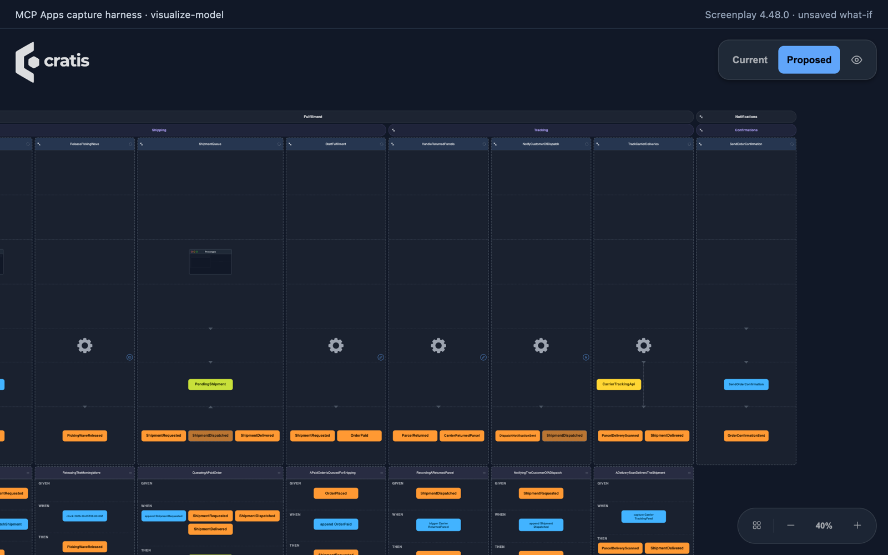
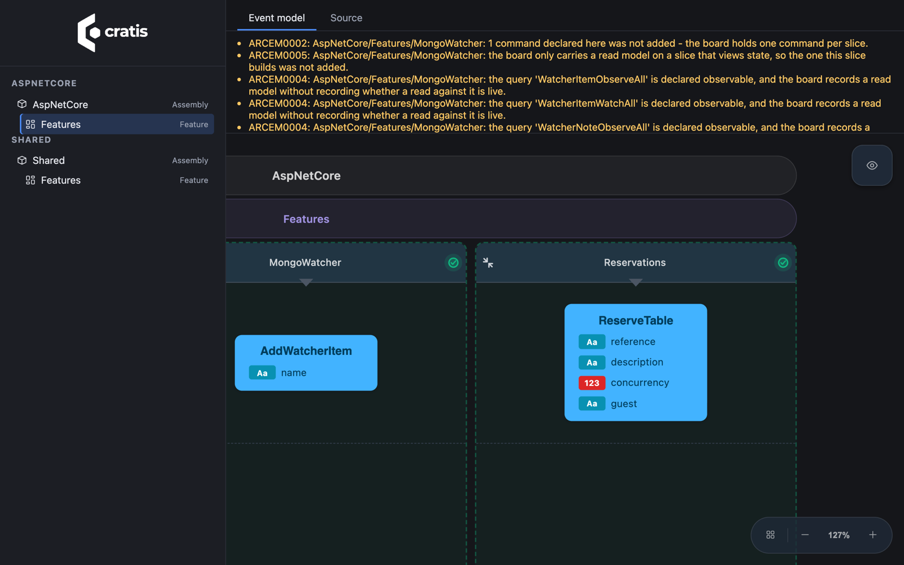
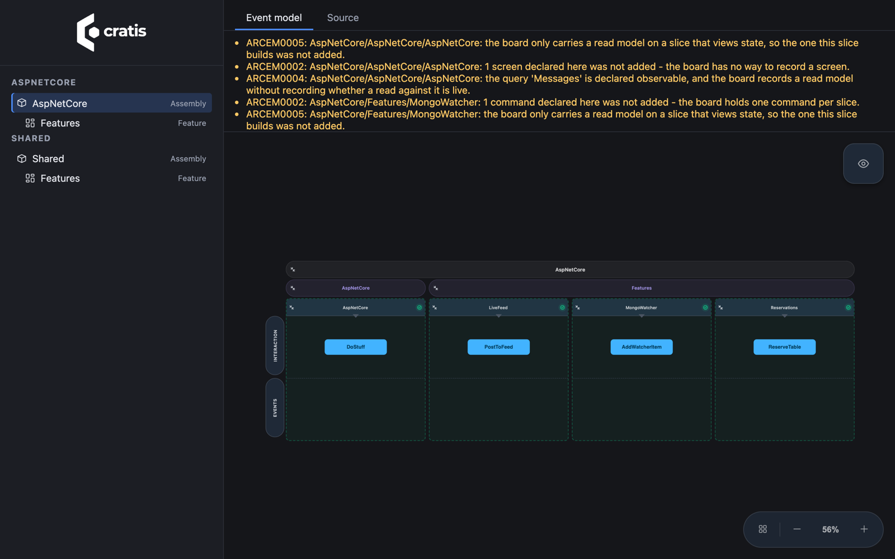

Open a `.play` model and follow a feature from the screen to its command, events,
and read model. The same event model board is available in VS Code, an MCP App,
your running Arc application, the CLI's browser explorer, and Cratis Studio.
You do not need to redraw the diagram for each place.

**Allow about 10 minutes.** Start in VS Code, then choose the other place that
fits your work. You need VS Code with its `code` command on `PATH` and a `.play`
model. For a ready-made example, open the
[Commerce sample](https://github.com/Cratis/Screenplay/tree/main/Samples/Commerce)
from a Screenplay checkout; keep the whole folder, not just one slice file.
The AI path needs .NET 10 and an MCP Apps-capable host. The code paths need a
compatible .NET SDK, restored project dependencies, and the
[Cratis CLI](/cli/getting-started/).

## Open the board in VS Code

1. Install the extension:

   ```bash
   code --install-extension cratis.screenplay
   ```

2. Open your model's folder in VS Code, then open a `.play` file. For Commerce,
   choose `Ordering/Orders/PlaceOrder.play`. The extension opens the board by
   default, compiles the surrounding application, and draws the open file's
   slices. Open the root `application.play` to see the whole model.
3. Choose **Show Source** in the editor title bar. Edit the text beside the board
   and watch it redraw. Pan to a slice and use **View** to show properties or
   switch between **Full** and **Overview**.


*Extension 4.48.1 in code-server, showing Commerce. Newer versions focus the board
on the open file's slices; open `application.play` for the whole application.*

You have succeeded when you can find `PlaceOrder`, the `OrderPlaced` event it
produces, and the specifications below the slice. The text remains the source of
truth. See [VS Code extension](vscode.md) for editor associations and folder rules.

Explicit specification routes appear in the specification header, labeled by
`given`, `when append` or `then` occurrence. The summary retains `for`,
`stream Source.Stream`, scalar `streamId` values, named composite part mappings in authored order and `no stream` assertions,
including when event cards show the linked event's current name instead of the
step's name. Headers wrap so long route summaries remain readable. Payload values
and event links stay unchanged. The board shows authored expectations, not test
results. The reference runner checks these route assertions in the event routes
ESM version; drawing them alone does not prove they pass.

Specification headers also show deterministic `generated` fixtures, labeled
**not request inputs**, scalar or record `then returns` assertions, and every
`then no readmodel ... for ...` absence assertion with its key. These summaries
keep response expectations and missing read-model instances visible without
turning them into event cards or command inputs. Like the rest of the board, these are specification expectations, not test
results; use the specification runner to check them.

Typed examples show their effective values: inherited event, command and
read-model fields are expanded, and a value stated on the step overrides the
example's value. Event links point to the example's underlying event declaration,
not the example name. Inherited `generated` fixtures remain separate from request
inputs. Headers show given and expected read-model values, retaining `exactly`
where it is stated.

A `when redelivered` action shows the event, target reaction and optional `for`
selector, with its payload values on the action card. It does not become an
append or another command. Refusal outcomes retain their ordinary presentation:
`then error` carries a validation or constraint refusal message, `then denied`
is an authorization denial, and expected refusal facts remain event cards.
An explicit `then no events` appears in the header rather than as a fabricated
event or error. Redelivery and no-event expectations are labeled
**Syntax-only (PLAY0268)**: drawing them does not make them executable or prove
once-only delivery. See [redelivery specifications](specifications.md#redelivery-specifications-syntax-only).
Specifications without these header details keep their titles.

## Ask for the board in an AI chat

Install the standalone tool if you do not already have it:

```bash
dotnet tool install --global Cratis.Screenplay.Tool
screenplay mcp ./specifications
```

Replace `./specifications` with an existing physical model directory. This starts
a stdio server, not a browser; your host normally launches the command for you.
For example, put this in VS Code's `.vscode/mcp.json` when the workspace contains
that directory:

```json
{
  "servers": {
    "screenplay": {
      "type": "stdio",
      "command": "screenplay",
      "args": ["mcp", "${workspaceFolder}/specifications"]
    }
  }
}
```

Other hosts use their own configuration format with the same command and
arguments. Connect, then ask: **“Show my event model with visualize-model.”**
The host must advertise `io.modelcontextprotocol/ui`; without MCP Apps support,
`visualize-model` is not offered.

The board requires **Cratis.Screenplay.Tool 4.47.0 or later**, or **CLI versions
that bundle Screenplay 4.47.0 or later**. CLI hosting itself shipped in 3.11.0:
you can use `cratis screenplay mcp ./specifications` instead, with `command`
`cratis` and `args` `["screenplay", "mcp", "${workspaceFolder}/specifications"]`.
An older CLI can host MCP without offering the board. See
[Install the MCP server](mcp/install.md) for setup and recovery.

Use the same tool in three ways:

| You want to see | Call `visualize-model` with | What happens |
| --- | --- | --- |
| The model on disk | `{}` | Draws the application under the server root. |
| A proposed change against disk | `{"proposalId": "<proposalId>"}` | **Current** and **Proposed** switch between disk and the retained authoring proposal. |
| A what-if that writes nothing | A `sketch` array of whole documents, each with `path` and `source` | Overlays the scratch documents on disk for this view only; it does not retain or apply them. |

Ask the assistant to pass either `proposalId` or `sketch`, never both. A sketch
replaces the whole document at each supplied path, not a fragment of it. Paths
are relative to the model root. For multi-file sketches, use Screenplay 4.59.1 or
later, or a CLI that bundles it; older versions such as 4.48.0 have sketch-path
failures. Keep the original files intact. The [MCP board guide](mcp/view.md) shows
the argument shapes.



*Captured in a minimal MCP Apps test host (a local capture harness), not a
commercial chat host. This capture uses a single-file Commerce adaptation and an
unsaved Notifications sketch.*

Viewing never applies a proposal. Keep approval enabled for `apply` and
`recover-workspace`, and review the exact plan before allowing writes.

## Open it in your running Arc app

For an ASP.NET Core application using Arc, add
`Cratis.Arc.Screenplay.Embedded` and follow Arc's
[embedded event-model setup](/arc/backend/csharp/embedded-event-model/).
Build and run the app, then open **`/.cratis/event-model/`** on its local address.
Select a project or feature; switch to **Source** to inspect its generated `.play`.

The route is **development-only by default**. Automatic hosting through the
`Cratis` metapackage needs a Debug (non-optimized) build **and** the
Development environment. Calling `app.MapCratisEventModel()` or setting
`Enabled = true` still opts in wherever the app runs, so guard explicit mapping
with `app.Environment.IsDevelopment()` or require authorization. The Arc guide
covers disabling generation and protecting the route. This board reads source-derived resources embedded during the build,
not stored events or live business data.



*The Arc AspNetCore sample is not event-sourced: its event lanes are empty.
Conversion warnings remain visible.*

## View a project without starting its app

With CLI 3.23.0 or later, point the browser explorer at your project:

```bash
cratis view ./MyApp/MyApp.csproj
```

The CLI serves the explorer on loopback and opens your browser. It reads embedded
documents from built output (Debug by default), or generates them in memory when
none are available. Select a document to see the board. Stop the terminal process
with **Ctrl+C** when finished. Use `--from-source` to regenerate rather than read
embedded output, or `--no-browser` to open the printed URL yourself.



*The CLI and runtime routes use the same explorer; neither starts the business
application to inspect its model.*

## Share a public model with Studio

The anonymous viewer needs no account:

```text
https://view.cratis.studio/?url=<public .play URL>
```

Replace the placeholder with a URL-encoded, publicly accessible raw `.play` URL,
not a GitHub HTML file page. The anonymous viewer works with self-contained,
single-file models supported by its compiler; it does not follow file imports
yet. A Commerce slice is a fragment, and its root imports the other files. Do not
expect either URL to load that sample.
Never put a private model URL, access token, or customer data into a share link.

For editing, sign in to [Cratis Studio](https://app.cratis.studio/). Import a
Screenplay `.play` file or a folder zip into an event model, review the import's
warnings, and accept only what you intend to keep. Export either a single `.play`
document or a folder zip to bring the model back to your editor. Review the
exported source: canvas import/export is not a lossless round trip for every
language construct.

## Get a model from existing code

If your code came first, generate the structure it already declares:

```bash
cratis screenplay generate ./MyApp/MyApp.csproj --provider arc --file MyApp.play
```

Use `arc` for Arc/Chronicle source, `marten` for Marten, or `critter-stack` for
Marten with Wolverine. Omit `--provider` for automatic detection. Generation
reads a Roslyn compilation; it does not start the app or connect to its event
store. Read the diagnostics before treating the output as complete. See
[Arc generation](/arc/backend/csharp/generating-a-screenplay/) and the
[Critter Stack guides](/screenplay/ecosystem-examples/critter-stack/).

Treat the generated model as a starting point to review, not a reconstruction
of the system. Open the generated file in VS Code. In CI, validate it and fail on
warnings:

```bash
cratis screenplay validate ./MyApp.play --warnings-as-errors
```

With no path, validation checks the current directory as one application. Use a
CLI bundling a compiler that understands your model's syntax. The standalone
alternative is `screenplay ./MyApp.play --warnaserror`; its flag is different.

## Know what the picture does not prove

- **A board is a visualization, not execution.** The editor and browser boards
  parse and draw the model; they do not run commands or specifications.
- **Drawing is not full validation.** Boards can draw partial models with errors.
  Use the compiler and CI validation for acceptance, not the presence of cards.
- **Generation is not full reconstruction.** It recovers recognized source
  declarations, not arbitrary handler logic, every UI detail, or runtime behavior.
  Diagnostics and conversion warnings describe gaps; do not hide them.
- **Versions matter.** A released surface can bundle an older compiler. MCP Apps
  support, CLI hosting, language support, and viewer support are separate checks.
- **Sharing exposes structure.** Keep runtime routes local and public viewer URLs
  public-safe. No viewing step here requires applying an AI proposal.

Next, [model your first feature](getting-started.md) or
[review a change with MCP](mcp/edit.md).
