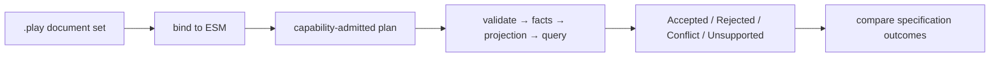

# Specifications

Specifications express Given/When/Then scenarios against a slice's behavior, or read-only Given/Then scenarios against established state — executable documentation for the behavior a slice implements. A `specification` block lives inside a `slice`, alongside its `command`, `event`, `projection` and other constructs, and is compiled by the Screenplay compiler like every other sub-language.

## Syntax

```screenplay
specification <Name>
  [file <path>]
  given <EventType>
    [for <event-source-value>]
    <property> = <value>
  given readmodel <ReadModelType>
    <property> = <value>
  given caller
    authenticated
    role "<role>"
    claim "<type>" = "<value>"
  when <CommandType>
    [for <event-source-value>]
    <property> = <value>
  when append <EventType>
    [for <event-source-value>]
    <property> = <value>
  then events in any order
  then <EventType>
    [for <event-source-value>]
    <property> = <value>
  then readmodel <ReadModelType> [exactly]
    <property> = <value>
  then query <Query> [exactly]
    arguments
      <argument> = <value>
    result
      <property> = <value>
  then error ["<message>"]
  then denied
```

- `given <EventType>` — zero or more. Establishes prior state by replaying events onto the slice's event source before the command runs.
- `given readmodel <ReadModelType>` — zero or more. Establishes prior read model state directly, for scenarios where expressing the state as events would be noise.
- `given caller` — zero or one. Explicit authentication, roles, and repeatable claim values for authorization. No fixture is inferred for an authorized scenario (`PLAY0389`).
- `when <CommandType>` or `when append <EventType>` — at most one action. Append directly establishes an event occurrence, checks append-time constraints, projects it, then checks read models and queries; it does not run a command. Without `when`, provide at least one `then readmodel` or `then query`; `then` events and errors require an action (`PLAY0352`).
- `then <EventType>` — zero or more. Compares the complete set of new facts, in authored order by default. For `when append`, if any `then` events are asserted, they must match exactly the appended fact (no extra facts); omit them to check only projected state or queries.
- `then events in any order` — once per specification. Compares all asserted events by event type, payload, and optional source without regard to order, still requiring the exact number of new facts. Without it, order matters.
- `then readmodel <ReadModelType> [exactly]` — zero or more. The read model state after projection. By default, only asserted properties need match; `exactly` also disallows unasserted properties.
- `then query <Query> [exactly]` — zero or more. Executes the named query with the authored `arguments` and compares its ordered `result` blocks. By default, rows match asserted properties as a subset; `exactly` requires all properties to match. Row count and order are always exact. No `result` blocks means the query is expected to return nothing.
- `then denied` — zero or one. Expects the typed `Unauthorized` rejection, not a validation or constraint error. For a read-only query, declare one `then query` with arguments and no `result`, followed by `then denied`; for a command, do not combine it with any success or error outcome.
- `then error ["<message>"]` — zero or more. An expected rejection. See [Rejections](#rejections).
- `file <path>` — zero or one. The repository relative file the specification is realized by. See [File references](file-references.md).
- `for <event-source-value>` — zero or one inside an event `given`, the command `when`, an event `then`, or an event `when append`. It identifies occurrence context rather than an event payload property.

A `for` assertion selects ESM v2 (language and semantics `2.0`, canonical JSON `schemaVersion: 2`). `given` establishes a fact on that event source; `then` checks both the event payload and its event source. `when for` asserts the command's destination and supplies a deterministic identity when allocation is needed; `when append` with `for` supplies the occurrence source and selects v2 under the same rule. The value must be a concrete scalar of the command's unambiguous destination type. This lets a constraint specification establish a claim on one source and attempt the same value on another. A consumer pinned to ESM v1 must explicitly opt in to v2 before accepting such a model.

Property values (`<property> = <value>`) accept literals (including `null`), single-line JSON-shaped objects and lists with quoted keys, and the same mapping expressions as `produces` and `capture`. For example, `lines = [{"sku":"A-1","quantity":2}]` and `tags = []` are typed values, not opaque expressions. Keys must name properties of the target's declared composite `type`; list items are checked against the element type. Unknown or imported shapes remain undecided. A value with the wrong object/list shape is an error.

Executable specification values must be concrete: literals, inline objects and lists. The ESM binds object members to the declared composite properties and list items to the element type, preserving authored list order. An empty list `[]` is valid for any collection property. Objects must supply every required member; optional members may be omitted. `null` is valid only for an optional read-model property (including nested properties). `null` in command or event values, even nested ones, is rejected (`PLAY0350`): in Chronicle, an optional fact is a separate event. Non-literal mapping expressions other than typed objects and lists are not portable specification values in ESM v1.

For example, if `OrderView` declares `lines Line[]`, `tags String[]`, and `note String?`, and `Line` declares `sku String`, you can seed `lines = [{"sku":"A-1"}]`, `tags = []`, and `note = null` in a `given readmodel` block. A `then readmodel` may assert just the identifier and `lines`; the list must match in order.

## Rejections

A rejection comes in two forms, and the difference between them is real.

`then error "<message>"` says **rejected, for this reason** — a constraint violation, a validation message the specification is deliberately pinning down:

```screenplay
specification RejectingAnInvoiceWithNoLines
  when RegisterInvoice
    invoiceId = "9c858901-8a57-4791-81fe-4c455b099bc9"
  then error "An invoice must have at least one line"
```

Neither `then error` form asserts a validation severity. A bare `then error` matches any rejection, and `then error "<message>"` matches the message regardless of whether the failed rule was marked `information`, `warning` or `error`. The specification grammar has no severity assertion; inspect the reference execution rejection's `ValidationFailures` when testing presentation metadata directly.

A bare `then error` says **rejected for a validation or constraint reason this specification does not name**. It never matches the `Unauthorized` category; use `then denied` for that. Most specifications are this kind — the reason lives in the specification's name, not in an assertion, and there is nothing in the behavior under test that names it:

```screenplay
specification RejectingAnInvoiceWhoseNumberIsAlreadyTaken
  given InvoiceRegistered
    invoiceNumber = "INV-000123"
  when RegisterInvoice
    invoiceNumber = "INV-000123"
  then error
```

An authorized scenario must declare an explicit `given caller` block. A read-only query scenario can assert denial by writing `then query <Query>` with its `arguments`, no `result` block, and `then denied`. The query declaration names the operation and `then denied` names its outcome. For example, a policy requiring role `Reviewer` can be checked with `given caller` containing `authenticated`, `role "Reviewer"`, and repeated `claim "department" = "Finance"` lines, followed by `then denied` when the role or claim does not satisfy the policy. The runner does not invent a caller if the block is absent: binding fails with `PLAY0389`. An unauthenticated caller may be stated explicitly with an empty `given caller` block.

To assert a localized rule's rejection, quote the key in the specification: `then error "$strings.invoices.validation.reasonRequired"`. Unlike a validation rule's `message` operand, the `then error` grammar accepts only quoted messages (or a bare `then error`), not `then error $strings.invoices.validation.reasonRequired`. The reference runner compares the symbolic key and requires the rejection's `MessageIsStringKey` marker; it never loads translated text. A realization resolves the key against the active locale's paired `.strings` file before displaying it. See [Internationalization](internationalization.md#executable-semantic-model-and-rejections).

Write the bare form rather than `then error ""`. An empty string reads as a reason someone left blank; the bare form says one was never stated. Both forms may appear in the same specification, and both round-trip through the [printer](printing.md) unchanged — which is what keeps generated documents diffable.

## Query results

A read model assertion proves that projected state exists. A query assertion proves that callers can actually retrieve the expected state through the declared read contract. State must not be used as an implicit query assertion because one read model can have several queries with different arguments and filtering.

```screenplay
specification LookingUpARegisteredProject
  when RegisterProject
    projectId = "3fa85f64-5717-4562-b3fc-2c963f66afa6"
    name = "Screenplay"
  then query ProjectById
    arguments
      projectId = "3fa85f64-5717-4562-b3fc-2c963f66afa6"
    result
      projectId = "3fa85f64-5717-4562-b3fc-2c963f66afa6"
      name = "Screenplay"
```

Repeat `result` for a query that returns several items. Their order is the authored comparison order. To assert that an optional or collection query returns nothing, omit `result`:

```screenplay
specification NotFindingAnUnknownProject
  when RegisterProject
    projectId = "3fa85f64-5717-4562-b3fc-2c963f66afa6"
    name = "Screenplay"
  then query ProjectById
    arguments
      projectId = "00000000-0000-0000-0000-000000000000"
```

The query declaration already states its return read model. A `result` block asserts only the properties it states; the key can be omitted when the query `arguments` supply it. Result row count and order remain exact. A missing asserted property does **not** match an asserted `null`: `null` matches only an explicitly present null value.

## Example

```screenplay
slice StateChange RegisterInvoice

  command RegisterInvoice
    invoiceId  InvoiceId
    customerId CustomerId

  event InvoiceRegistered
    invoiceId  InvoiceId
    customerId CustomerId

  specification RegisteringADraftInvoice
    given CustomerRegistered
      customerId = "3fa85f64-5717-4562-b3fc-2c963f66afa6"
      name       = "Acme Corp"
    when RegisterInvoice
      invoiceId  = "9c858901-8a57-4791-81fe-4c455b099bc9"
      customerId = "3fa85f64-5717-4562-b3fc-2c963f66afa6"
    then InvoiceRegistered
      invoiceId  = "9c858901-8a57-4791-81fe-4c455b099bc9"
      customerId = "3fa85f64-5717-4562-b3fc-2c963f66afa6"

  specification RejectingAnInvoiceWithNoLines
    when RegisterInvoice
      invoiceId = "9c858901-8a57-4791-81fe-4c455b099bc9"
    then error "An invoice must have at least one line"
```

## Read model state

When a scenario is really about derived state rather than events, `given readmodel` seeds the read model directly and `then readmodel` asserts what it should look like afterwards:

```screenplay
  specification SendingADraftInvoice
    given readmodel InvoiceListReadModel
      invoiceId = "9c858901-8a57-4791-81fe-4c455b099bc9"
      status    = "draft"
    when ChangeInvoiceStatus
      invoiceId = "9c858901-8a57-4791-81fe-4c455b099bc9"
      status    = "sent"
    then InvoiceSent
      invoiceId = "9c858901-8a57-4791-81fe-4c455b099bc9"
    then readmodel InvoiceListReadModel
      invoiceId = "9c858901-8a57-4791-81fe-4c455b099bc9"
      status = "sent"
```

`given readmodel` seeds a complete instance and must include the identifier property. `then readmodel` also must include the identifier to select the instance, but asserts only its stated properties. The identifier is inferred from the read model's keyed query (see [Read models](readmodels.md)); omitting it produces `PLAY0351` at that block. Additional properties in actual state do not fail a subset assertion. A missing asserted property is different from a present property with a `null` value.

You can omit `when` to check established state without running a command:

```screenplay
specification LookingUpAnExistingInvoice
  given readmodel InvoiceSummary
    invoiceId = "9c858901-8a57-4791-81fe-4c455b099bc9"
    status = "draft"
  then query InvoiceById
    arguments
      invoiceId = "9c858901-8a57-4791-81fe-4c455b099bc9"
    result
      status = "draft"
```

The reference runner establishes `given` events, projects them, applies complete `given readmodel` states, then queries and compares. A when-less specification may also assert `then readmodel`, but not events or errors. With a `when`, event, read-model and query assertions can be combined as needed. An appended event can also be rejected by an append-time constraint using `then error`. Reactions triggered by the appended event are **not** executed: reactions are not part of the ESM.

## Reference execution

Screenplay supplies a framework-neutral reference path for admitted semantic capabilities. It does not start Arc, Chronicle, a database, the filesystem, or a network service. It executes against an immutable in-memory world so Stage and rendered targets have one normalized behavior to match.



The minimum evaluator currently admits the RegisterProject-style vertical: declarative validation rules on command properties and concepts (`not empty`, `max`/`min`, the ordering and equality comparisons, `length ==`, and `all >`/`all >=` — see [what the executable model admits](commands.md#what-the-executable-model-admits)), unconditional and command-property-conditional event production, command-property `require` guards, literal append tags, optional snapshot lookup, and ordered query rows with subset property assertions. A failed rule rejects the command with the rule's message. Projections run with the reference semantics of Chronicle's projection engine - children, nested objects, update-only joins, `every` and `all`, removals and every mapping kind; see [Projections in the semantic model](projections/semantic-model.md). Unsupported reachable declarative capabilities block plan creation rather than producing a partial or stubbed execution. Opaque ESM v3 reducer transitions, rule predicates, and code validations are admitted to the plan; execution that needs them returns Unsupported instead of guessing their outcome.

```csharp
var semanticCompilation = semanticCompiler.Compile("Projects", documents);
var planCompilation = SemanticExecutionPlan.Compile(semanticCompilation.Value!.Model);
var specificationId = planCompilation.Plan!.Specifications.Keys.First();
var run = new SemanticSpecificationRunner().Run(planCompilation.Plan, specificationId);
```

Tags are append metadata: `then` event assertions compare payload properties and ignore tags unless explicitly asserted by a future tag-aware assertion contract. A command with all production conditions false is accepted with zero facts. A rejected execution returns the unchanged world. An accepted execution commits its facts and projected state once, then evaluates the requested queries against that tentative committed state. The same normalized specification run is the conformance input for Stage and generated applications.

## The specification vocabulary at a glance

| Construct | Meaning |
| --- | --- |
| `given <EventType>` | Prior state, established by one or more events before the command runs. |
| `given readmodel <ReadModelType>` | Prior read model state, established directly. |
| `given caller` | Explicit identity, roles, and repeated claims. |
| `when <CommandType>` | The command under test, with its property values. |
| `when append <EventType>` | Append an event occurrence, enforce constraints and project it; no reactions run. |
| `then events in any order` | Ignore order, but still require the exact set of new facts. |
| `exactly` on read model or query | Compare every property rather than the default subset. |
| `then <EventType>` | An expected new fact; if asserted, the full new fact set must match. |
| `then readmodel <ReadModelType>` | The read model state expected after the command. |
| `then query <Query>` | Ordered query results for explicit arguments; no `result` means empty. |
| `arguments` | The values supplied to the query. |
| `result` | One expected query result; repeat for many. |
| `then error "<message>"` | A rejection, for the named reason. |
| `then error` | A validation or constraint rejection without a named reason. |
| `then denied` | A typed authorization denial (`Unauthorized`). |
| `<property> = <value>` | A property value, using the same expression grammar as `produces`/`capture` mappings. |

## Compiling specifications

Specifications compile as part of a full application document via `IScreenplayCompiler.Compile`, or standalone — source rooted at a `specification` declaration — via `IScreenplayCompiler.CompileSpecification`, mirroring `CompileProjection` for the [Projection Declaration Language](projections/index.md).
