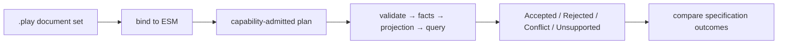

# Specifications

Run scenarios with [`screenplay test`](tool.md#run-the-models-specifications) or the read-only MCP [`run-specifications`](mcp/reference.md#execute-specifications) tool. Both use the in-memory reference evaluator; binding alone does not tell you whether a scenario passes.

## Operation specifications (syntax-only)

> Operation fixtures and assertions are experimental authoring syntax. The current reference runner cannot execute them; binding refuses them with `PLAY0268` because they are not admitted by any supported executable model (ESM) version yet.

For a command producing declared [operations](operations.md), `given operation NotifyAccounting fails` requests a failure fixture, `then operation SendWelcomeEmail` asserts a requested operation with optional **partial** input values, and `then compensated SendWelcomeEmail` asserts declared compensation. Failure and compensation lines are leaves: they cannot have children. Requested-operation fields must be unique and have compatible concrete values, including quoted enum values. All references must resolve to the operation kind, not an event with the same spelling, and require a command action. Static checks do not prove reachability, rollback success or repeated-invocation matching.

The [complete source fixture](https://github.com/Cratis/Screenplay/blob/main/Documentation/screenplay/fixtures/operations.play) shows success and compensation intent with their declarations and command inputs. These assertions express desired future behavior, not passing execution today.


Specifications express Given/When/Then scenarios against a slice's behavior, or read-only Given/Then scenarios against established state — executable documentation for the behavior a slice implements. A `specification` block lives inside a `slice`, alongside its `command`, `event`, `projection` and other constructs, and is compiled by the Screenplay compiler like every other sub-language.

## Persona callers

Name a top-level persona instead of repeating its policy witness:

```screenplay
policy IsAccountant
  require role "Accountant"
persona Accountant
  policy IsAccountant
module Billing
  feature Invoices
    slice StateChange RegisterInvoice
      command RegisterInvoice
        invoiceNumber String
        authorize IsAccountant
        produces InvoiceRegistered
          invoiceNumber = invoiceNumber
      event InvoiceRegistered
        invoiceNumber String
      specification RegisteringAsAnAccountant
        given caller as Accountant
        when RegisterInvoice invoiceNumber = "INV-42"
        then InvoiceRegistered invoiceNumber = "INV-42"
```

Unknown or malformed references and body lines report `PLAY0572`. If synthesis is refused, binding reports `PLAY0573` with the persona, policy, refusal reason and explicit-caller remedy. This is not a runtime unsupported outcome. Inspect the selected roles and claims in hover or MCP's persona `caller` view. A persona-backed denial scenario uses the same form with `then denied`.

## Named case tables

Use a table when scenarios share their steps but differ in concrete inputs or expected messages:

```screenplay
specification RecordingAmounts
  parameter amount Int
  case Small amount = 10
  case Large
    amount = 100
  when Record amount = case.amount
  then Recorded amount = case.amount
```

A table declares typed `parameter` values and at least one named `case`. Every case assigns every parameter exactly once, inline or indented. Values are concrete literals, single-line objects or lists; a case cannot name an example, use mapping expressions, `$` values or another case reference. `optional` permits literal `null`, not an omitted assignment or a default. Unused parameters warn with `PLAY0588`.

`case.<parameter>` fills a whole specification value position. It is substituted **after** example resolution and step overrides. Parameter and target types must match, or be a concept and its underlying primitive in either direction. An optional parameter can feed only an optional target. Every row value, including unused parameters, follows ordinary fixture normalization; substituted values still follow the target's ordinary admission rules.

Use references in step assignments, generated fixtures, query arguments and results, `for` values, absent read-model keys, or `streamId = case.<parameter>` inside a restated route. An event's `for` target is inferred from that event's producers (or its declared routed source identifier), not the command under test; this also applies to `when append` without a command action. `when trigger` assignments use the declared trigger's data types. Standalone specification documents retain primitive and structural checks, including known String error-message targets. Concept and composite parameter types whose declarations are unavailable remain unknown, as do declaration-dependent targets; parsing never treats the missing owning application as an empty declaration inventory. `then error case.reason` takes a String parameter; a value such as `"$strings.nameRequired"` retains its symbolic-message meaning. References cannot replace callers, redelivery locators, clocks, declaration names, step kinds or members inside structured literals. Pass the whole object or list instead.

Each row runs independently as `<Specification>_<Case>`, in case order, inheriting the table description. Derived names must not collide with other specifications or derived names in the same scope. The executable bytes and revision match hand-written specifications with those names; the table is authoring syntax, not a new executable-model version. The board titles cards `<Specification> — <Case>`.

A table address selects all rows in `run-specifications` scope and `screenplay test --filter`; a derived address selects one. Source-bound failures start with `Case '<Case>' of '<Specification>':`. MCP's specification `cases` view pages names, effective addresses, locations and values; `find-fixtures` accepts the table or effective address and an optional `case` filter, with case-parameter provenance.

For C# consumers, `SpecificationExamples.ExpandAll(specification, application, scope)` returns every effective case. The singular `Expand` refuses tables with `PLAY0589`. `EffectiveSpecification.Case`, the `Case` value origin and `CaseParameter` retain source provenance. TypeScript's effective expansion exposes `table` and `case` on each pair.

## Authoring descriptions

Add one `description` to state which rule or case a specification witnesses. Use `description "<text>"` for one line, or a fenced `text` block for several lines. The field is report-only (`PLAY0270`): it does not change execution or executable-model bytes. Specifications do not accept `documentation`; put longer modeling reasoning on the owning slice. See [Descriptions and documentation](slices.md#descriptions-and-documentation).

```screenplay
specification RejectingAnEmptyName
  description "Witnesses that a project must have a name"
  when RenameProject
    name = ""
  then error "A name is required"
```

## Syntax

```screenplay
specification <Name>
  [description "<rule or case>"]
  [file <path>]
  given <EventType>
    [for <event-source-value>]
    <property> = <value>
  given readmodel <ReadModelType>
    <property> = <value>
  given caller
    authenticated
    role "<role>"
    claim "<type>" = "<value>"
  given clock "<ISO 8601 instant>"
  given capture <Capture>
    <field> = <value>
  when <CommandType>
    [for <event-source-value>]
    <property> = <value>
  when append <EventType>
    [for <event-source-value>]
    <property> = <value>
  when redelivered <EventType> to <Reaction> // syntax-only
    [for <event-source-value>]
    [<property> = <value> ...]
  when clock "<ISO 8601 instant>"
  when trigger <Trigger>
    <value> = <value>
  when capture <Capture>
    <field> = <value>
  when query <Query>
    <argument> = <value>
  then no events // syntax-only
  then events in any order
  then <EventType>
    [for <event-source-value>]
    <property> = <value>
  then readmodel <ReadModelType> [exactly]
    <property> = <value>
  then no readmodel <ReadModelType> for <key>
  then query <Query> [exactly]
    arguments
      <argument> = <value>
    result
      <property> = <value>
  then result [exactly]
    <property> = <value>
  then no result
  then error ["<message>"]
  then denied
```

- `given <EventType>` — zero or more. Establishes prior state by replaying events onto the slice's event source before the command runs.
- `given readmodel <ReadModelType>` — zero or more. Establishes prior read model state directly, for scenarios where expressing the state as events would be noise.
- `given caller` or `given caller as <Persona>` — zero or one, never both. The explicit block states authentication, roles, and repeatable claim values. The persona form has no body and expands into an authenticated deterministic witness satisfying every persona policy; see [persona synthesis](personas.md#persona-callers-in-specifications). Either form satisfies the caller requirement for an authorized scenario (`PLAY0389`). It supplies no actor to reaction invocations.
- `when <CommandType>` or `when append <EventType>` — at most one action. Append directly establishes an event occurrence, checks append-time constraints, projects it, then checks read models and queries; it does not run a command. Without `when`, provide at least one `then readmodel`, `then no readmodel`, or `then query`; `then` events and errors require an action (`PLAY0352`).
- `when redelivered <EventType> to <Reaction>` — syntax-only action selecting exactly one given event occurrence for one compatible event-trigger reaction. It participates in the same one-action rule and is not yet executable (`PLAY0268`). See [Redelivery specifications](#redelivery-specifications-syntax-only).
- `then <EventType>` — zero or more. Compares the complete set of new facts, in authored order by default. For `when append`, if any `then` events are asserted, they must match exactly the appended fact (no extra facts); omit them to check only projected state or queries.
- `then no events` — once per specification, with no children. Explicitly expects no new events after a non-append action. It can accompany read-model, query or response assertions, but not event expectations, `then events in any order`, errors or denial (`PLAY0545`). It is rejected after `when append`. It is syntax-only: binding refuses it with `PLAY0268` until the same admission checkpoint as refusal handling and redelivery. Existing executable contracts still require at least one success outcome for a successful action; an outcome-less specification does not bind.
- `then events in any order` — once per specification. Compares all asserted events by event type, payload, and optional source without regard to order, still requiring the exact number of new facts. Without it, order matters.
- `then readmodel <ReadModelType> [exactly]` — zero or more. The read model state after projection. By default, only asserted properties need match; `exactly` also disallows unasserted properties.
- `then no readmodel <ReadModelType> for <key>` — zero or more. Asserts that precisely the keyed instance is absent, not that it exists with empty or null properties, and not that a query result is empty. The concrete key is required and type-checked against the view identifier. It has no children or `exactly` qualifier. Presence and absence for the same view and key conflict.
- `then query <Query> [exactly]` — zero or more. Executes the named query with the authored `arguments` and compares its ordered `result` blocks. By default, rows match asserted properties as a subset; `exactly` requires all properties to match. Row count and order are always exact. No `result` blocks means the query is expected to return nothing.
- `then denied` — zero or one. Expects the typed `Unauthorized` rejection, not a validation or constraint error. For a read-only query, declare one `then query` with arguments and no `result`, followed by `then denied`; for a command, do not combine it with any success or error outcome.
- `then error ["<message>"]` — zero or one. An expected rejection, with no success outcomes in the same specification. See [Rejections](#rejections).
- `file <path>` — zero or one. The repository relative file the specification is realized by. See [File references](file-references.md).
- `for <event-source-value>` — zero or one inside an event `given`, the command `when`, an event `then`, or an event `when append`. It identifies occurrence context rather than an event payload property.

Without a routing line, a `for` assertion selects ESM v2 (language and semantics `2.0`, canonical JSON `schemaVersion: 2`). `given` establishes a fact on that event source; `then` checks both the event payload and its event source. `when for` asserts the command's destination and supplies a deterministic identity when allocation is needed; `when append` with `for` supplies the occurrence source and selects v2 under the same rule. The value must be a concrete scalar of the event's producer command's unambiguous destination type (or the command under test for `when for`). A `StateView` slice can use `when append … for` to specify an event declared in a different slice when its producer supplies that type. This lets a constraint specification establish a claim on one source and attempt the same value on another. A consumer pinned to ESM v1 must explicitly opt in to v2 before accepting such a model.

Property values (`<property> = <value>`) accept literals (including `null`), single-line JSON-shaped objects and lists with quoted keys, and the same mapping expressions as `produces` and `capture`. For example, `lines = [{"sku":"A-1","quantity":2}]` and `tags = []` are typed values, not opaque expressions. Keys must name properties of the target's declared composite `type`; list items are checked against the element type. Unknown or imported shapes remain undecided. A value with the wrong object/list shape is an error.

Executable specification values must be concrete: literals, inline objects and lists. The ESM binds object members to the declared composite properties and list items to the element type, preserving authored list order. An empty list `[]` is valid for any collection property. Objects must supply every required member; optional members may be omitted. `null` is valid only for an optional read-model property (including nested properties). `null` in command or event values, even nested ones, is rejected (`PLAY0350`): in Chronicle, an optional fact is a separate event. Non-literal mapping expressions other than typed objects and lists are not portable specification values in ESM v1.

For example, if `OrderView` declares `lines Line[]`, `tags String[]`, and `note String optional`, and `Line` declares `sku String`, you can seed `lines = [{"sku":"A-1"}]`, `tags = []`, and `note = null` in a `given readmodel` block. A `then readmodel` may assert just the identifier and `lines`; the list must match in order.

## Typed specification examples

Use an example when several scenarios repeat the same command input, prior event or read-model state. Keep each scenario's action and outcome visible; an example is one typed instance, not a multi-step setup. Both compilers parse and preserve declarations and inline assignments. C# resolves and expands examples before executable binding. The executable model contains only the merged values, with the same bytes and revision as hand-expanded steps.

`example <Name> : <EventOrCommandOrReadModel>` declares one named, possibly partial fixture. Its body accepts property assignments, an optional `description`, an optional `for` value, and command `generated` fixtures. It cannot contain caller or clock fixtures or Given/When/Then steps. Declare examples at slice, feature, module or document level, or alongside specifications in a specification-only document.

An example reference occupies the ordinary name slot in `given`, `given readmodel`, `when`, `when append`, `then`, or `then readmodel [exactly]`. Names may be qualified. One concrete assignment may follow the name on the same line, including a structured object or list; other assignments stay indented. There is no `with` keyword.

This excerpt assumes `RegisterInvoice` declares `total` and `currency`, and `InvoiceRegistered` declares `total`. The example is partial: the step must supply any remaining required command inputs.

```screenplay
example AcmeInvoice : RegisterInvoice
  total = 1000
  currency = "EUR"

specification RegisteringAcme
  when AcmeInvoice total = 5000
    currency = "NOK"
  then InvoiceRegistered total = 5000
```

Here, `total = 5000` overrides `1000` inline, and the indented `currency = "NOK"` overrides `"EUR"`. Unchanged example values are inherited. A value supplied only by the step is authored, not an override, including a new `for` destination or `generated` fixture. Override a structured object or list as a whole; there is no recursive member merge. An indented `for` replaces the example's destination, and `generated` fixtures merge by property name. The same assignment spellings also work on ordinary type names without an example.

| Example kind | Supported step slots |
| --- | --- |
| Event | `given <Example>`, `when append <Example>`, `then <Example>` |
| Command | `when <Example>` |
| Read model | `given readmodel <Example>`, `then readmodel <Example> [exactly]` |

Examples share the type namespace: a name colliding with an event, command, read model, type, concept, or import is an error. The underlying type resolves in the example's declaration scope, not where it is used. Examples always use the current event generation and cannot inherit from another example. A step of the wrong kind reports a suggested corrected spelling. At executable binding, a `when` command must belong to the specification's own slice; a qualified command or example from another slice cannot select a same-named local command.

Syntax consumers can call `SpecificationExamples.Expand(application)` in `Cratis.Screenplay.Syntax.Specifications`. The result contains the effective application, authored/effective specification pairs, resolution diagnostics, and each step's effective values with `Authored`, `Example`, or `Override` provenance. Overrides retain the replaced expression; all expressions retain their source locations. Each event step also has an optional init-only `Route` (`EffectiveSpecificationRoute`), carrying the effective stream or no-stream node, its origin and the replaced example route. A missing route has no entry. The authored syntax is not changed. Check diagnostics before consuming the effective view. For a standalone specification, call `SpecificationExamples.Expand(specification, declarations, scope)`, supplying the owning application and its module/feature/slice scope segments; document-scoped examples are included automatically.

MCP `find-fixtures` reports those effective values, their origins and replaced values. Declaration search and details include `Example`; reference queries connect specification steps to the example and the example to its underlying type. Workspace rename proposals update example uses, underlying type references and specification names while preserving proven bindings. See the [MCP reference](mcp/reference.md#typed-specification-examples).

At binding, given events and read models, command inputs other than generated properties, appended events, and expected events must state every required property after expansion. Each missing property reports `PLAY0524` at its step, naming the example when used. Partial examples are allowed, but an exact-shape step must complete them. No implicit fixture defaults are supplied. Expected read models keep subset matching unless `exactly` is authored; using an example does not change that rule.

Binding validates every stated example value, even in an unused example or one whose invalid value is overridden. Scalar types, enum membership, nested object completeness, null rules, generated UUID fixtures and `for` identities follow ordinary executable fixture admission. An unknown or ambiguous destination type refuses binding rather than inventing one. This does not require all top-level properties of a partial example to be supplied, execute validation rules, or make unsupported application behavior executable. Syntax acceptance alone is not semantic admission.

Source-bound reference execution uses `SemanticSpecificationRunner.Run(compilation, specificationId)`. Failed comparisons retain their original failure text and append the effective fixture values, their authored/example/override origins, and replaced values. The compilation owns the provenance sidecar; no sidecar enters ESM bytes. `Run(plan, specificationId)` remains available for ESM-only consumers, but cannot reconstruct source origins and does not invent them. Unsupported plan admission is a failed result, not a passing scenario.

Event examples may carry `stream Source.Stream` with a scalar id or composite part block, or `no stream`. A step inherits the route unless it states a replacement: the whole route is replaced, never just an id or part. `for` remains independent. A `then` may replace an inherited route with `no stream`; a `given` may replace inherited `no stream` with a route. There is no spelling to restore a wildcard route once an example states one. Command and read-model examples refuse routes with `PLAY0526`; a command's route belongs to its declaration, and read models have none. Top-level `stream = <value>` and `streamId = <value>` are payload assignments.

Declaration checks run once at the example, even if it is unused or every use overrides its route. Its `for` is typed by the route's source identifier, not by other producers of the event. Role checks use the effective route: inherited `no stream` on `given` or `when append` reports `PLAY0547` at the step, naming the example. Missing routed `for`, newly incompatible overridden `for`/route pairs (`PLAY0550`) and effective `then` contradictions (`PLAY0551`) are also reported at the step. An unchanged inherited pair reuses the declaration result without duplicate errors. Routed examples remain syntax-only (`PLAY0268`), including unused ones.

TypeScript exports `expandSpecificationExamples(application)` from `@cratis/screenplay-compiler` for syntax consumers such as the event model board. It returns application syntax with resolved examples expanded into effective specification values without changing the authored application. For event-step provenance, `expandEffectiveSpecificationExamples(application)` returns the effective application and specification pairs whose event steps retain authored/example/override values and whole-route origins. Route overrides retain the replaced stream or no-stream node. This TypeScript view does not return resolution diagnostics; neither expansion API executes specifications.

Examples cannot supply callers, clocks or whole scenarios, and cannot be used in query results, `then result`, `then returns`, trigger or capture fixtures. Composite-value examples, inheritance and named setups are not supported; named case tables above cover repeated scenario shapes, while pipe-table outlines remain unsupported; structured values inside an event, command or read-model example are supported. There are no implicit defaults or unused/shadowing warnings.

Assign a property only once within each fixture or step. An inline assignment repeated in the indented body reports `PLAY0519`; a malformed example header reports `PLAY0518`. A declaration does not supply implicit defaults or change the step's matching mode. Unlike `seed`, an example declares specification data, not events to append when the application starts.

## Event routes

Specification `stream` and `no stream` statements select executable semantic model **v8**. The reference runner places routed history and appended facts, and compares explicitly stated routes. Specifications without these statements keep their existing semantics.

An event occurrence in `given`, `when append` or `then` can name a source-owned stream:

```screenplay
domain Banking
eventsource Account
  identifier String
  stream Transactions
    streamId String
  stream Profile
module Accounts
  feature History
    slice StateView Recording
      event Recorded
        amount Decimal
      specification ReadingAnotherPartition
        given Recorded
          for "other"
          stream Account.Transactions
            streamId = "p-1:2026-10"
          amount = 100
        when append Recorded
          for "other"
          amount = 40
        then Recorded
          no stream
          amount = 40
```

The example seeds routed history, appends an unrouted fact and asserts that its route is absent. `Account` declares an `identifier String`, a keyed `Transactions` stream with `streamId String`, and an unkeyed `Profile` stream. `Source.Stream` resolves by exact names against the complete compilation input; ambiguity is refused rather than guessed.

- Put `stream`, `for` and payload lines in any order. An occurrence takes at most one `stream` or `no stream`, once. The printer places the route after `for` and before payload.
- A scalar keyed stream requires exactly one nested `streamId = <literal>` of its declared type. A composite stream instead requires a bare `streamId` header with every declared `<part> = <literal>` exactly once; unknown and duplicate parts are refused. Scalar and composite forms cannot substitute for each other; an unkeyed stream accepts neither. Text must be nonempty, well-formed Unicode NFC; non-NFC text and lone UTF-16 surrogates are refused, never repaired. Whitespace is accepted. Double-mode integer literals must be within ±9007199254740991; exact-mode integers have no formatter bound. These checks use the shared stream-id formatter for both scalar ids and composite parts. Text such as `"p-1:2026-10"` remains an opaque scalar id, never inferred parts.
- Composite contradiction checks compare each part by name under the same resolved stream using its canonical scalar formatting, not authored spelling or mapping order. UUID case variants compare equal; a difference in any known canonical part proves a contradiction. Command paths and unavailable imported types defer to execution. The executable comparison uses the same rule as the [canonical encoding contract](event-sources.md#canonical-stored-encoding).
- Routed `given` and `when append` require a concrete `for` literal of the named source's `identifier` type. A routed `then` may omit `for`. A source with no identifier needs exactly one known destination type across all event producers; otherwise declare an identifier on the source. The prebinding check conservatively refuses fallback when a reaction, capture or other producer's destination cannot be determined from syntax.
- Routes belong to occurrences, not event types. Another producer with a different destination does not invalidate history on a source with its own identifier. An expected route or `for` type is refused only if it contradicts the command under test and that command is the event's only producer in the whole model; other producers defer the comparison.
- `then`, redelivery locators and event examples accept `no stream`, asserting or selecting an unrouted occurrence. A `then` without either routing line leaves the route unspecified. `given` and `when append` without a route remain unrouted. `when <Command>` refuses both lines: its route belongs to the command declaration. Read-model and query steps do not take routes.
- `stream = 5` and `streamId = 6` remain payload mappings at event level. Only the nested scalar mapping or named part block is route metadata. Source-only routes have no spelling yet.

See [event sources](event-sources.md) for source and stream declarations and [diagnostics](diagnostics.md) for `PLAY0547`–`PLAY0551`. Specifications without these new lines keep their existing diagnostics and executable semantics. Renaming an event preserves its occurrence routing metadata. MCP `propose-rename` repairs command and specification routes and migrates source/stream catalog entries atomically. Pin a stored name before renaming a declaration with stored events; an unpinned rename changes the stored route classification.

At ESM v8, `then events in any order` finds a one-to-one assignment between expectations and facts, so a wildcard expectation cannot steal the only fact matching an exact routed expectation. Earlier versions retain their existing greedy comparison. An explicit `no stream` requires an absent route, not a route filled with Chronicle defaults. Route comparisons do not change projections, constraint scope or query behavior.

## Rejections

A rejection comes in two forms, and the difference between them is real.

`then error "<message>"` says **rejected, for this reason** — a constraint violation, a validation message the specification is deliberately pinning down:

```screenplay
specification RejectingAnInvoiceWithNoLines
  when RegisterInvoice
    invoiceId = "9c858901-8a57-4791-81fe-4c455b099bc9"
  then error "An invoice must have at least one line"
```

Neither `then error` form asserts a validation severity. A bare `then error` matches any rejection, and `then error "<message>"` matches the message regardless of whether the failed rule was marked `information`, `warning` or `error`. The specification grammar has no severity assertion; inspect the reference execution rejection's `ValidationFailures` when testing presentation metadata directly.

A bare `then error` says **rejected for a validation or constraint reason this specification does not name**. It never matches the `Unauthorized` category; use `then denied` for that. Most specifications are this kind — the reason lives in the specification's name, not in an assertion, and there is nothing in the behavior under test that names it:

```screenplay
specification RejectingAnInvoiceWhoseNumberIsAlreadyTaken
  given InvoiceRegistered
    invoiceNumber = "INV-000123"
  when RegisterInvoice
    invoiceNumber = "INV-000123"
  then error
```

An authorized scenario must declare an explicit `given caller` block. A read-only query scenario can assert denial by writing `then query <Query>` with its `arguments`, no `result` block, and `then denied`. The query declaration names the operation and `then denied` names its outcome. For example, a policy requiring role `Reviewer` can be checked with `given caller` containing `authenticated`, `role "Reviewer"`, and repeated `claim "department" = "Finance"` lines, followed by `then denied` when the role or claim does not satisfy the policy. A command or query guarded by an opaque policy predicate returns `SemanticUnsupported` (Authorization capability) naming the policy when its outcome matters. Neither `then denied` nor a successful query/event assertion can pass on that unknown result; a portable `and` denial or `or` allowance can settle a mixed gate without running the opaque predicate. The runner does not invent a caller if the block is absent: binding fails with `PLAY0389`. An unauthenticated caller may be stated explicitly with an empty `given caller` block.

To assert a localized rule's rejection, quote the key in the specification: `then error "$strings.invoices.validation.reasonRequired"`. Unlike a validation rule's `message` operand, the `then error` grammar accepts only quoted messages (or a bare `then error`), not `then error $strings.invoices.validation.reasonRequired`. The reference runner compares the symbolic key and requires the rejection's `MessageIsStringKey` marker; it never loads translated text. A realization resolves the key against the active locale's paired `.strings` file before displaying it. See [Internationalization](internationalization.md#executable-semantic-model-and-rejections).

Write the bare form rather than `then error ""`. An empty string reads as a reason someone left blank; the bare form says one was never stated. Choose either the bare or the quoted form for a specification: the executable model accepts exactly one rejection and no success outcomes. Both forms round-trip through the [printer](printing.md) unchanged — which is what keeps generated documents diffable.

## Query results

A read model assertion proves that projected state exists. A query assertion proves that callers can actually retrieve the expected state through the declared read contract. State must not be used as an implicit query assertion because one read model can have several queries with different arguments and filtering.

```screenplay
specification LookingUpARegisteredProject
  when RegisterProject
    projectId = "3fa85f64-5717-4562-b3fc-2c963f66afa6"
    name = "Screenplay"
  then query ProjectById
    arguments
      projectId = "3fa85f64-5717-4562-b3fc-2c963f66afa6"
    result
      projectId = "3fa85f64-5717-4562-b3fc-2c963f66afa6"
      name = "Screenplay"
```

Repeat `result` for a query that returns several items. Their order is the authored comparison order. To assert that an optional or collection query returns nothing, omit `result`:

```screenplay
specification NotFindingAnUnknownProject
  when RegisterProject
    projectId = "3fa85f64-5717-4562-b3fc-2c963f66afa6"
    name = "Screenplay"
  then query ProjectById
    arguments
      projectId = "00000000-0000-0000-0000-000000000000"
```

The query declaration already states its return read model. A `result` block asserts only the properties it states; the key can be omitted when the query `arguments` supply it. Result row count and order remain exact. A missing asserted property does **not** match an asserted `null`: `null` matches only an explicitly present null value.

## Example

```screenplay
slice StateChange RegisterInvoice

  command RegisterInvoice
    invoiceId  InvoiceId
    customerId CustomerId

  event InvoiceRegistered
    invoiceId  InvoiceId
    customerId CustomerId

  specification RegisteringADraftInvoice
    given CustomerRegistered
      customerId = "3fa85f64-5717-4562-b3fc-2c963f66afa6"
      name       = "Acme Corp"
    when RegisterInvoice
      invoiceId  = "9c858901-8a57-4791-81fe-4c455b099bc9"
      customerId = "3fa85f64-5717-4562-b3fc-2c963f66afa6"
    then InvoiceRegistered
      invoiceId  = "9c858901-8a57-4791-81fe-4c455b099bc9"
      customerId = "3fa85f64-5717-4562-b3fc-2c963f66afa6"

  specification RejectingAnInvoiceWithNoLines
    when RegisterInvoice
      invoiceId = "9c858901-8a57-4791-81fe-4c455b099bc9"
    then error "An invoice must have at least one line"
```

A then-event route assertion uses the producing event's effective route. A production override replaces the whole command route, including its stream id. Omitting a then route leaves routing unasserted. See [Production routes](event-sources.md#production-route-overrides).

## Read model state

When a scenario is really about derived state rather than events, `given readmodel` seeds the read model directly and `then readmodel` asserts what it should look like afterwards:

```screenplay
  specification SendingADraftInvoice
    given readmodel InvoiceListReadModel
      invoiceId = "9c858901-8a57-4791-81fe-4c455b099bc9"
      status    = "draft"
    when ChangeInvoiceStatus
      invoiceId = "9c858901-8a57-4791-81fe-4c455b099bc9"
      status    = "sent"
    then InvoiceSent
      invoiceId = "9c858901-8a57-4791-81fe-4c455b099bc9"
    then readmodel InvoiceListReadModel
      invoiceId = "9c858901-8a57-4791-81fe-4c455b099bc9"
      status = "sent"
```

`given readmodel` seeds a complete instance and must include the identifier property. `then readmodel` also must include the identifier to select the instance, but asserts only its stated properties. Explicit `key` properties replace inference. Without them, the identifier is inferred from the read model's keyed query or one unambiguous `*Id` property (see [Read models](readmodels.md#keys)). Fixtures for a composite key state every key property; omitting any part produces `PLAY0351`. A composite absence assertion uses an object with every named part. Composite views and their fixtures remain unadmitted and report `PLAY0268` citing #599. Additional properties in actual state do not fail a subset assertion. A missing asserted property is different from a present property with a `null` value.

A projection can remove one instance while another remains. For example, with `InvoiceView` keyed by `invoiceId` through a query `InvoiceById => InvoiceView optional` whose body declares `by invoiceId InvoiceId`, and a projection declaring `remove with InvoiceRemoved key invoiceId`:

```screenplay
specification RemovingOneOfTwoInvoices
  given readmodel InvoiceView
    invoiceId = "first"
  given readmodel InvoiceView
    invoiceId = "second"
  when append InvoiceRemoved
    invoiceId = "first"
  then no readmodel InvoiceView for "first"
  then readmodel InvoiceView
    invoiceId = "second"
```

The absence assertion selects ESM v5 (language and semantics `5.0`, canonical `schemaVersion: 5`); existing v1–v4 models retain their bytes and revisions. The reference runner compares both the view identity and the semantic key, so a surviving instance under another key does not fail the absence check. Opaque reducer-built read models still require a target provider: their absence returns typed `SemanticUnsupported`, not a passing assertion. ESM consumers must explicitly admit v5 before using it.

Typed workspace authoring binds each member of a composite absence key to the identifier type of the read model's keyed query. Safe authoring rejects a new key member that doesn't resolve, keeps existing unresolved members that the edit leaves unchanged, and accepts an explicit repair of a key member, an enclosing member or the keyed query's `by` identifier. Draft authoring accepts new unresolved key members and reports them as reference debt (`PLAY0198`). An edit that would silently change what an existing key member binds to is refused in both modes: a declaration edit, such as changing a property's type or removing the property, can repair an unresolved member but can't retarget or unbind a resolved one, so edit the assertion itself for that. A whole-document replacement in which an unresolved absence assertion can't be matched to exactly one original is also refused in both modes. Renaming a composite-type property also renames the absence-key members bound to it. A rename is refused while any absence key in the workspace is unresolved; repair the key first.

You can omit `when` to check established state without running a command:

```screenplay
specification LookingUpAnExistingInvoice
  given readmodel InvoiceSummary
    invoiceId = "9c858901-8a57-4791-81fe-4c455b099bc9"
    status = "draft"
  then query InvoiceById
    arguments
      invoiceId = "9c858901-8a57-4791-81fe-4c455b099bc9"
    result
      status = "draft"
```

The reference runner establishes `given` events, projects them, applies complete `given readmodel` states, then queries and compares. A when-less specification may also assert `then readmodel` or `then no readmodel`, but not events or errors. With a `when`, event, read-model and query assertions can be combined as needed. An appended event can also be rejected by an append-time constraint using `then error`. Before ESM v6, `then` events after `when append` equal the appended fact and nothing reacts to it; since ESM v6, the reactions it sets off run - see [Clocks, triggers and captures](#clocks-triggers-and-captures).

## Performing a query

A view nothing builds from events - one a query's `performer` composes from somewhere else - has no command or event to act on. `when query` makes reading the action, and `then result` the outcome:

```screenplay
specification LookingUpTheEuroRate
  given readmodel ExchangeRate
    currency = "EUR"
    rate = 11.52
  when query ExchangeRateFor
    currency = "EUR"
  then result
    rate = 11.52
```

The lines under `when query` are its arguments, each a `by` or `filter` parameter of the query (`PLAY0468` otherwise). Repeat `then result` for a query that returns several rows - their order is the authored order - and add `exactly` to compare every property. `then no result` asserts the query returns nothing, and `then denied` that the caller may not perform it. A `when query` must assert one of the three (`PLAY0465`).

This says the same thing as `then query` with `arguments` and `result` blocks, and binds to the same executable model - choose whichever reads better. `when query` is the Given/When/Then reading: given this state, when someone asks, then this is what they get.

## Clocks, triggers and captures

Reactions run because time passes, because an application trigger fires, and captures run because a source record changes. Each has an action of its own:

```screenplay
specification ChasingAnOverdueInvoiceEveryMorning
  given clock "2026-10-05T07:00:00Z"
  given InvoiceMarkedOverdue
    for "9c858901-8a57-4791-81fe-4c455b099bc9"
    overdueAt = "2026-10-04T00:00:00Z"
  when clock "2026-10-05T08:00:00Z"
  then InvoiceReminderSent
    for "9c858901-8a57-4791-81fe-4c455b099bc9"
    reminderNumber = 2
```

| Form | Means |
| --- | --- |
| `given clock "<instant>"` | The scenario happens at this instant. Everything mapped from `$context.occurred` takes this value, so an event property mapped from it can be asserted. At most once. |
| `when clock "<instant>"` | The clock reaches this instant, so every reaction scheduled with `every` or `at` that is due by then runs. |
| `when trigger <Trigger>` | A declared or registered application trigger fires, carrying the values beneath it. A value the trigger does not carry is a warning (`PLAY0466`). |
| `given capture <Capture>` | An earlier record of a capture's source, so a value transition such as `when status from "sent" to "paid"` has something to transition from. Repeatable. |
| `when capture <Capture>` | The capture sees this record of its source. The lines beneath are the record's fields, named as the source names them. |

An instant is ISO 8601 with an explicit offset or `Z`, such as `2026-10-05T08:00:00Z` (`PLAY0461` otherwise), so the same text means the same moment wherever the specification runs.

These forms, and the automation and translate slices whose reactions and captures they drive, bind to ESM v6 ([decision 0022](https://github.com/Cratis/Screenplay/blob/main/decisions/0022-esm-v6-time-triggers-captures-and-reactions-in-specifications.md)), and the reference runner executes them:

- **Every action sets reactions off.** After a command, an append, a clock tick, a trigger or a capture record, each new fact runs the reactions to its event, and what those append or the commands they invoke run more, until nothing is left to react to. `then` events compare every new fact, the action's and the reactions'.
- **An appended event is the action itself.** After `when append`, `then` events are what followed it - what reactions appended - the way a command's `then` events are what it produced.
- **`given clock` fixes when the scenario happens.** Every command, append and reaction occurs at that instant; an occurrence a clock tick sets off occurs at the instant it fell due. A specification with `when clock` states `given clock` too, the instant the clock moves from. The clock states a time, not a caller, so a mapping from `$context.causedBy` is unsupported in a scenario that states one.
- **The clock is UTC and exact.** Each `every` or `at` occurrence due after `given clock` and at or before `when clock` fires exactly once, in time order. An interval counts from the Unix epoch; a schedule's time of day is UTC.
- **Captures compare records.** `given capture` is the record a capture last saw for a key, and `when capture` the record it sees now. Numeric and text keys remain distinct. Nested objects and lists of objects in a record are a capture's `nested` record and `children`. Child identities must be present and unique in each collection; reordering does not create additions or removals.

Reached reactions with a code body (`file` or an inline block) and reactions that never settle return `SemanticUnsupported` rather than a guessed outcome. Unrelated reactions and bodies excluded by `where` do not run. A later reaction failure retains earlier accepted facts; each invoked command remains atomic. The reference permits at most 1,000 new facts per scenario and 10,000 due occurrences per clock advance, failing closed at either limit. Clock occurrences are not fake input events, and capture sources are never contacted. A command a reaction invokes runs through its full pipeline with no caller, so a command that needs one rejects it, and that rejection ends the scenario. A model using any of these forms selects language and semantics `6.0` (canonical `schemaVersion: 6`); models without them keep their bytes and revisions.

The compiler's command-outcome check follows declared event reactions and invoked commands. It defers an event's values to execution when that reachable chain may produce the event, including another occurrence of a type the initiating command produces. Unreachable reactions do not suppress a provable contradiction. This check does not prove reaction guards or termination; reached opaque effects also defer proof to execution.

In v6, projection arithmetic outside the reference numeric range returns `SemanticUnsupported`, not a contract rejection. The overflowing append contributes no fact or partial projection state, earlier accepted facts remain, and an overflowing command contributes none of its transaction. An unsupported result never satisfies `then error`.

Default `Startup` and `Shutdown` signals carry no values. If a host registration overrides either with values or an unknown shape, semantic binding rejects its use until a typed trigger declaration supplies an admitted shape; a matching name alone does not make it an empty built-in.

## Redelivery specifications (syntax-only)

> Event redelivery is not yet executable. Both compilers parse and preserve `when redelivered`; the .NET compiler validates the reaction and occurrence locator. Binding refuses it with `PLAY0268`, and MCP reports it as unadmitted. It does not run as `when append` or silently omit the action.

Recovery can deliver an existing fact to one reaction without appending another fact. This syntax-only example declares the event and its observer before selecting a given occurrence:

```screenplay
module Billing
  feature Claims
    slice Automation Recovery
      event Approved
        invoice String
      reaction Claimer
        when Approved
      specification Recovery
        given Approved
          for "invoice-1"
          invoice = "invoice-1"
        when redelivered Approved to Claimer
          for "invoice-1"
          invoice = "invoice-1"
        then no events
```

`to <Reaction>` is required. The reaction must resolve unambiguously and observe the stated event (`PLAY0544` otherwise). The optional `for`, every stated property value and an optional route narrow the effective, example-expanded given occurrences of that event. Duplicate occurrences remain separate candidates. **Exactly one** must match (`PLAY0543` otherwise); an empty body is sufficient when there is exactly one given fact of that event. This is the specification's sole action, not an additional step after a command or append. `then no events` is also syntax-only and does not make a redelivery scenario executable. A locator without a route treats routes as a wildcard. `stream Source.Stream` requires the same resolved source and stream with canonically equal ids; composite parts compare in declaration order, so mapping order and UUID case do not matter. `no stream` selects only unrouted givens. A locator's `for` stays optional; when stated beside a route it must match the source identifier type (`PLAY0550`). Malformed route lines use `PLAY0547`, and resolution or key-shape errors use `PLAY0549`, never the command-only `PLAY0548`.

Each `for`, payload and route comparison is true, false or unknown. A definite false rules out the candidate even if another comparison is unknown. The locator succeeds only with exactly one definitely true candidate and no unknown candidates. Otherwise `PLAY0543` asks you to use `for`, values, `stream` or `no stream`. A routed locator receives separate `PLAY0268` refusals for redelivery and specification routes; admitting routes alone does not admit redelivery. A given without `for` retains a null source; its producer supplies a source type, not a concrete locator identity.

[Decision 0030](https://github.com/Cratis/Screenplay/blob/main/decisions/0030-reaction-refusals-and-redelivery.md) defines the intended execution at admission: establish givens without firing reactions, deliver the selected existing fact only to the named reaction, then settle the ordinary cascade. Do not append the fact again. New effects take the `given clock` instant, and event expectations compare all newly accepted facts. Delivery identity is the reaction paired with the selected given-fact position, not equality of event values as a runtime deduplication guarantee.

A `given caller` supplies no actor to a reaction invocation. Unhandled validation and constraint refusals remain assertable as `then error`; authorization denial uses `then denied`. Recovery redelivery is ordinary observation, not replay, and does not prove once-only external effects. Clock, application-trigger and capture repetition keep their existing action forms. Refusal branches have their own [syntax and admission boundary](reactions.md#refusal-branches-syntax-only).

## Reference execution

Screenplay supplies a framework-neutral reference path for admitted semantic capabilities. It does not start Arc, Chronicle, a database, the filesystem, or a network service. It executes against an immutable in-memory world so Stage and rendered targets have one normalized behavior to match.


```mermaid
flowchart LR
    Source[".play document set"] --> Bind["bind to ESM"]
    Bind --> Plan["capability-admitted plan"]
    Plan --> Execute["validate → facts → projection → query"]
    Execute --> Trace["Accepted / Rejected / Conflict / Unsupported"]
    Trace --> Compare["compare specification outcomes"]
```

The minimum evaluator currently admits the RegisterProject-style vertical: declarative validation rules on command properties and concepts (`not empty`, `max`/`min`, the ordering and equality comparisons, `length ==`, and `all >`/`all >=` — see [what the executable model admits](commands.md#what-the-executable-model-admits)), unconditional and command-property-conditional event production, command-property `require` guards, literal append tags, optional snapshot lookup, and ordered query rows with subset property assertions. A failed rule rejects the command with the rule's message. Projections run with the reference semantics of Chronicle's projection engine - children, nested objects, update-only joins, `every` and `all`, removals and every mapping kind; see [Projections in the semantic model](projections/semantic-model.md). Unsupported reachable declarative capabilities block plan creation rather than producing a partial or stubbed execution. Opaque ESM v3 reducer transitions, rule predicates, code validations, and policy predicates are admitted to the plan; execution that needs them returns Unsupported instead of guessing their outcome.

```csharp
var semanticCompilation = semanticCompiler.Compile("Projects", documents);
var planCompilation = SemanticExecutionPlan.Compile(semanticCompilation.Value!.Model);
var specificationId = planCompilation.Plan!.Specifications.Keys.First();
var run = new SemanticSpecificationRunner().Run(planCompilation.Plan, specificationId);
```

Tags are append metadata: `then` event assertions compare payload properties and ignore tags unless explicitly asserted by a future tag-aware assertion contract. A command with all production conditions false is accepted with zero facts. A rejected execution returns the unchanged world. An accepted execution commits its facts and projected state once, then evaluates the requested queries against that tentative committed state. The same normalized specification run is the conformance input for Stage and generated applications.

## The specification vocabulary at a glance

| Construct | Meaning |
| --- | --- |
| `given <EventType>` | Prior state, established by one or more events before the command runs. |
| `given readmodel <ReadModelType>` | Prior read model state, established directly. |
| `given caller` | Explicit identity, roles, and repeated claims. |
| `when <CommandType>` | The command under test, with its property values. |
| `when append <EventType>` | Append an event occurrence, enforce constraints and project it; in v6, run its reaction consequences. |
| `when redelivered <EventType> to <Reaction>` | Syntax-only: select exactly one given occurrence for one event-trigger reaction; not yet executable. |
| `given clock "<instant>"` | The instant the scenario happens at. |
| `given capture <Capture>` | An earlier record of a capture's source. |
| `when clock "<instant>"` | The clock reaches an instant; scheduled reactions that are due run. |
| `when trigger <Trigger>` | An application trigger fires with the values it carries. |
| `when capture <Capture>` | A capture sees one record of its source. |
| `when query <Query>` | Perform a query with its arguments. |
| `then result [exactly]` | One expected row of the performed query; repeat for several. |
| `then no result` | The performed query returns nothing. |
| `then no events` | Syntax-only assertion of no new facts after a non-append action; binding refuses it until admission. |
| `then events in any order` | Ignore order, but still require the exact set of new facts. |
| `exactly` on read model or query | Compare every property rather than the default subset. |
| `then <EventType>` | An expected new fact; if asserted, the full new fact set must match. |
| `then readmodel <ReadModelType>` | The read model state expected after the command. |
| `then query <Query>` | Ordered query results for explicit arguments; no `result` means empty. |
| `arguments` | The values supplied to the query. |
| `result` | One expected query result; repeat for many. |
| `then error "<message>"` | A rejection, for the named reason. |
| `then error` | A validation or constraint rejection without a named reason. |
| `then denied` | A typed authorization denial (`Unauthorized`). |
| `<property> = <value>` | A property value, using the same expression grammar as `produces`/`capture` mappings. |

## Generated fixtures and return expectations

Generated fixtures and `then returns` select **ESM v7** and execute in the reference runner. They pin [generated values and responses](commands.md#generated-values-and-responses) separately from request inputs and emitted events. See the [complete fixture](https://github.com/Cratis/Screenplay/blob/main/Documentation/screenplay/fixtures/generated-responses.play).

```screenplay
specification RegisteringReturnsIdentifiers
  when RegisterProject
    for "11111111-1111-1111-1111-111111111111"
    generated receiptId = "22222222-2222-2222-2222-222222222222"
    name = "Apollo"
  then ProjectRegistered
    for "11111111-1111-1111-1111-111111111111"
    name = "Apollo"
  then returns
    receiptId = "22222222-2222-2222-2222-222222222222"
```

`for` supplies the generated identifier. An indented `generated <name> = <value>` supplies a nonidentifier generated command property, separately from request mappings. Do not put either on the `when` header. Ordinary `generated = <value>` remains an input mapping for a property named `generated`.

A scalar response uses `then returns <value>`; a record uses `then returns` with a nonempty subset of its named fields. The expectation must match the response shape and types. Values must be concrete literals or structured values, with no raw-expression fallback or trailing tokens. Duplicate, unknown, nongenerated or identifier fixture targets are rejected. A return expectation requires a command action, occurs at most once and cannot accompany `then error` or `then denied`; successful event/state assertions may coexist. The reference runner compares scalar values by semantic equality and records by the asserted subset, reporting differences in response field order. Optional absent sources yield `Null`; composites compare by property identity and arrays in order. `then returns` counts as a success outcome, but it does not relax event comparison: a command specification with no expected events still asserts that no facts were produced.

Missing fixtures are bindable. If execution reaches generation without every generated value supplied, it returns `Unsupported(IdentityAllocation)` and the specification never passes; it does not invent random values. Authorization denial and validation failure happen before generation and keep their own outcomes. A reaction-invoked response-only command runs and discards its response; a reached invocation needing generation has no fixture channel and returns `Unsupported(IdentityAllocation)`.

For a generated identifier, `for` travels in the generated-value channel, not the legacy event-source allocation channel. It does not assert that explicitly routed productions use that identifier; expected events assert their own destinations. For commands without generated identifiers, `when … for` keeps its existing destination assertion. A generated identifier with a reached plain legacy allocated production needs two separate channels, which source specifications cannot supply together, so that combination is `Unsupported(IdentityAllocation)`. Source fixtures and return expectations on generated UUID-backed values normalize accepted UUID spellings to lowercase hyphenated form; existing non-generated values are unchanged. Relational assertions without concrete fixtures remain deferred.

## Compiling specifications

Specifications compile as part of a full application document via `IScreenplayCompiler.Compile`, or standalone — source rooted at a `specification` declaration — via `IScreenplayCompiler.CompileSpecification`, mirroring `CompileProjection` for the [Projection Declaration Language](projections/index.md).
