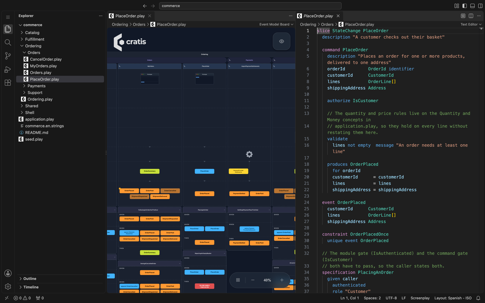

# VS Code extension

The Screenplay extension for Visual Studio Code (`cratis.screenplay`) opens a `.play` file on the **event model board**, the board Cratis Studio draws. The model reads as a timeline:

- modules and features across
- each slice as a column holding its command, the events it produces and the read model it builds
- the specifications of each slice beneath it
- the screens of each slice, drawn as a prototype in the row of each [persona](personas.md) who may use it, above the slice

The text stays the source of truth. The board redraws as you edit, and the language support (highlighting, completion, hover and diagnostics) is one click away.

```bash
code --install-extension cratis.screenplay
```

Open your model folder, then a `.play` file. Choose **Show Source** to edit beside
its board. For other places to open the same board, see
[See your event model](see-your-event-model.md).



*Extension 4.48.1 in code-server, showing Commerce. Newer versions focus the board
on the open file's slices; open `application.play` for the whole application.*

## Restricted Mode

In an untrusted workspace, the board and local language assistance (including
TypeScript diagnostics) remain available. C# repair processes require workspace
trust and explicit User settings; they never run in Restricted Mode. VS Code
ignores workspace overrides for `screenplay.sourceRoot` and the repair settings
until you trust the workspace. A source-root override can point outside the
workspace, so review it before granting trust.

## Generated values and responses

The editor recognizes [generated command values and response contracts](commands.md#generated-values-and-responses), including fixture and assertion fields, inferred response types and generated-not-input hints. Completion uses the current source, including unsaved edits. Hover and completion identify these constructs as executable in ESM v7; the editor no longer reports syntax-only response information markers. Compiler diagnostics validate syntax, not semantic binding or execution: pre-generation references and generated-concept rules are checked by the C# semantic binder. Missing reference-execution fixtures and other unadmitted constructs still prevent successful execution.

The board leaves generated values out of command request schemas and lists generated values and returns in command details. It does not create response events or emit official response types. TextMate highlighting treats ambiguous two-token `returns` lines conservatively; `returns @name` makes response intent explicit.

## Public-event authoring (syntax-only)

Monaco and VS Code recognize standalone `public event` declarations and `event Name from "origin"`. Origins are opaque contract metadata, not links to files. Public events retain event-body completion, and event hover includes visibility and origin. Translate slices offer `direction inbound` or `direction outbound`; other slice types do not offer direction. Invalid headers and directions use the existing compiler diagnostics (`PLAY0005`, `PLAY0018`, `PLAY0027`). TextMate highlighting keeps public-event metadata and event-body directives distinct from property-shaped names.

Both editors validate public/private operational event boundaries (`PLAY0607`–`PLAY0620`) against the assembled model, including imported files and unsaved buffers. Public translations require explicit direction; outbound translations must produce exactly one local public event type. Unresolved or ambiguous references remain unclassified.

This is authoring support, not transport or execution support. The board document preserves nondefault metadata without inferring delivery guarantees. The C# binder refuses these declarations with `PLAY0268`. See [events](events.md) and [imports](imports.md) for the contracts.

## Event source and stream authoring

Monaco and VS Code use typed source declarations and command routes from the complete input, including current unsaved buffers. They offer exact `Source.Stream` references and proven compatible command sources for `streamId`, with nominal types preserved. Composite `streamId` blocks offer scalar-subset declaration types, unmapped route part names, compatible command paths and specification literal snippets. Hover exposes declared parts, part types and mapping sources. Contextual highlighting distinguishes the header from part names, including parts named `streamId` or `stream`. Source/stream hover describes authored identifier/key types; contextual tokens do not globally reserve property names. Navigation requires a unique physical source and stream plus authoritative placement, and points to the actual identifier in its original document. Duplicate parents, competing value-type interpretations, comments and fences do not become guessed links.

The C# binder and reference runner admit routing in executable semantic model (ESM) v8, including specification routes and composite stream ids. Editor validation and the board do not execute routes. Existing command details show the authored stream and readable key expression, never inferred effective destinations, new event cards or successful execution states. No source/stream automatic rename, routing quick fix or inferred-routing inlay is provided. See [the source/stream support matrix](event-sources.md#tooling-support).

## Operation and system intent (syntax-only)

Both Monaco and VS Code recognize [systems and operations](operations.md), inline/standalone declarations and operation specification steps. Assistance resolves explicit declaration kinds over the assembled application and uses the current typed source for command inputs, including unsaved and import-placed files. Input/source suggestions retain concept, composite, optional and collection shapes; ambiguous references are not linked to an arbitrary declaration. Phase hover distinguishes pending, file and inline sources and ordered hints. Existing attachment navigation applies to phase files.

Operations are not admitted by any supported executable model (ESM) version yet (`PLAY0268`). Board command details describe system/operation intent and authored production order; there are no operation event cards, fabricated event identities or passing operation assertion states. Unknown or ambiguous production context receives no guessed destination hint. Keyword-named inputs, comments and fenced source remain their original content.

## Handler implementation intent

Both Monaco and VS Code offer `implementation` beneath a command handler, then ordered `hint` lines, `file` or existing tagged fences within its wrapper. Completion and hover describe pending intent and unavailable handler execution. New words stay ordinary property names outside those contexts. Parser diagnostics `PLAY0492`–`PLAY0494` retain original source locations; fenced code is isolated from DSL analysis and completion.

The board does not show handler execution outputs or confirmation status. This authoring feature adds no AI, lock or confirmation command. See [supported owners](commands.md#implementation-intent-handlers-only).

## Screens

Each slice that declares [screens](screens.md) gets a prototype in the board, in the row of each persona who may use it. A persona may use a slice's screens when the policies it holds satisfy everything the slice is gated by: the `authorize` of its module, its features and its own command or query, taken together. A slice that nothing gates, or that no persona satisfies, is shown in the generic **User** row. Once the model has a screen, the board draws a row for every persona, then the **User** row if a screen fell to it. Without a screen there are no rows.

The prototype is a sketch of what the screen holds, laid out top to bottom:

- titles
- actions, side by side
- tables, summaries and inline code
- the slots of a template, the header and footer spanning and the others side by side

Data a table or summary presents is not drawn twice. A screen implemented in a file is drawn as one content area.

## Completion that fits the block

Completion in the text editor offers only what the block under the cursor can hold. Monaco and VS Code share the same rules:

- A `slice` offers the members of its type: a `StateChange` slice, a `StateView` slice, an `Automation` slice and a `Translate` slice each get their own list.
- A module offers, among others, `feature`, `screen`, `form`, `contribute`, `import` and `depends on`; a feature offers its slices, nested features, `contribute` and `depends on`.
- After `depends on `, completion offers sibling features first, then the siblings of enclosing features, root modules and qualified paths to features elsewhere. It excludes self, ancestors, descendants and targets already declared by that container, including declarations in other workspace files. After a qualifier such as `Timesheets.`, it inserts only the feature name. Each suggestion describes the target's full address and its relation to the current container.
- `readmodel`, `reducer`, `form`, `contribute`, `behavior`, `persona`, `authentication`, `seed`, `theme`, `ui profile`, `layout`, and screen and dialog templates offer their own members.
- At the top level, `domain` and `authentication` are not offered again once the document declares them.

### Expand an empty command

On an empty line directly under `command <Name>`, completion lists the whole body as its first entry. The expansion is built from what the document declares:

- the identifier, when a concept named `<Subject>Id` is declared (for `AddProduct`, `productId ProductId identifier` needs a `ProductId` concept)
- the properties of the event the command most likely produces: a declared event whose name starts with the subject, otherwise the subject followed by the past tense of the verb (`AddProduct` gives `ProductAdded`)
- the `produces` of that event, with its `for` destination and property mappings, or `produces event` when the event is not declared

Pressing Enter after a block header indents one level, so the suggestion starts at the block's own indentation.

### Ghost text for structure

On an empty line inside a block whose next structure is missing, both editors show the structure the block most obviously needs as ghost text. Press Tab to accept it:

| Block | Suggestion |
| --- | --- |
| `command` with no `produces` or `handler` | the `produces` of the likely event, or the expansion above when the command has no properties yet |
| `specification` in a slice with a command | a `when` for the slice's command with example values, then a `then` for the likely event. A `given caller` with `authenticated` comes first when the command has an `authorize` |
| `form <Name> for <Command>` | a `field` for each property of the command |

Nothing is suggested inside a code fence, or when the block already has its outcome or the command it needs is not declared.

### Other extensions

The extension turns GitHub Copilot's inline suggestions off for `.play` files, so they do not compete with the language service. To bring them back, set `"github.copilot.enable": { "screenplay": true }`. It also registers the language's keywords with the Code Spell Checker extension, when installed, so words such as `readmodel` are not flagged. For `.play` files it turns word-based suggestions off.

## Dependency map

Choose **Map** in the board toolbar to see how modules and features depend on each
other. The map covers the whole application, even when the board shows only the
open file. Modules are columns with features inside; imported bounded contexts
appear on the right. Producers come first, so arrows point from consumer to producer.

Choose **Modules** or **Features** for the edges. By default, the map shows
**uses facts from**, **reacts to**, and **decides from**; check the other kinds to
include them. Edge labels count slice pairs. Select an edge to list the references
under each slice pair. Click a reference's source location to open its source.
Tab moves into the drawing; arrow keys move between nodes and edges, Enter selects,
and Escape clears.
Choose **Board** to return to the timeline; map selections do not highlight the board.

The selected node or edge, and its details, stay selected when you edit and the board
refreshes, as long as that item still exists. If it is gone, the selection clears.

## View options

The **View** button in the upper right of the board offers the view options Cratis Studio has:

- **Detail level**: **Full** draws each slice whole. **Overview** leaves out the specifications and the properties.
- **Properties** shows the properties of commands, events and read models.
- **Visualization**: **Arrows** connects slices with arrows, **Lines** with lines.

The choice is kept for you: every board, and every later session, opens with the view you last chose.

The collapse button on a module, feature or slice header folds it away while you look at the rest. It changes only how the board is drawn, never the model.

## Move between the board and the text

A `.play` file opens on the board by default. Use either of these to reach the text:

- **Show Source** in the board's title bar opens the text beside the board, so you can edit and watch the board follow.
- **Reopen Editor With…** › **Text Editor** shows the text in place of the board.

From a text editor, **Open Event Model Board** in the title bar, or in the Command Palette, goes back.

To always open `.play` files as text, add this to your settings:

```json
"workbench.editorAssociations": {
    "*.play": "default"
}
```

## Folder applications

A [folder of `.play` files](folders.md) is one application, and a file in it holds only its share of the model. When the file is inside a folder application, the board compiles the whole application and draws the file's share of it:

- The application is every `.play` file beneath the nearest folder that holds an `application.play`, which is the file the compiler writes at the root when it expands an application into folders.
- The search stays inside the workspace folder.
- Changes count wherever they are made: unsaved edits to any file of the folder, and files saved, created or deleted on disk.

What the file's share is depends on what it holds:

| The open file | The board shows |
| --- | --- |
| `application.play` at the root of the folder | The whole application |
| A slice file | Its slices |
| A feature or module file | The slices of the files it [imports](imports.md), and the slices other files place in the modules and features it declares |
| A file with no slice of its own, such as one that only declares concepts, types or policies | The whole application |

Every slice is drawn against everything the application declares, so a slice file's board has the same personas and events as the whole one. The problems listed above the board are the ones in the files it draws.

A file that is not inside a folder application is shown on its own - unless it [imports](imports.md) other files, in which case it is the root of an application and the board shows everything it imports.

## One application in the editor

The editor validates a workspace folder's `.play` files as one application, not file by file. A name declared in another file - an event, a policy, a concept, a query - is not reported as unknown, and a file an [import](imports.md) places in a module or feature is checked in that placement, so a focused file that holds only a `slice` validates cleanly. Import problems - a pattern that matches nothing, a file placed in two modules, an import cycle - are reported on the import that causes them. Unsaved edits count, and the folder is recompiled once a burst of edits settles.

Inside the quotes of an `import`, completion offers the `.play` paths of the workspace folder.

## Inline events in the text editor

Completion offers `produces event` inside commands and `for`, typed mappings, tags, `description`, `documentation`, and rename-only `id` inside its body. Inline events appear in event-name completion, hover, Go to Definition, and the board just like standalone events. Extracting one into the same slice keeps its board identity.

Inlay hints show `for <identifier>` on an inline production that omits its destination. A legacy plain omission shows `for <new event source>` only when no production in the command resolves a destination. An explicit sibling can supply a legacy command-level default, so the editor suppresses the hint rather than guessing. Hints also disappear when destinations conflict or an inline identifier cannot be determined. VS Code's standard inlay-hint settings control their visibility. The Monaco language service uses the same destination analysis.

The editor reports mixed-source omissions, declaration collisions, forbidden inline generations and origins, reserved system metadata, malformed documentation and identity pins. Redundant pins are information diagnostics, not warnings. Keep `id` absent for new events. Highlighting and hover treat `id` and `documentation` as directives only at the start of an event-body line with directive syntax; properties named `id` and projection keys such as `key id` remain names. Trailing comments and fenced prose do not change destination analysis.

## Optional values and quick fixes

Write `optional` after the type, as in `note String optional` or
`lines InvoiceLine[] optional`. Completion suggests this spelling and hover explains
that it allows the whole value to be absent. A property or type named `optional`
remains a name, not a keyword.

The [compatibility spelling](types.md#compatibility-note) receives information
diagnostic `PLAY0479`, marked deprecated rather than a warning. Use the lightbulb
to migrate one occurrence, or the document action to migrate all occurrences.
The fixes change only the spelling, retaining comments and spacing. They reparse
the current buffer and verify that its meaning is unchanged before offering edits.
Nothing is saved automatically. Stale buffer versions are refused. Monaco provides
the same verified fixes; neither editor needs a .NET process.

## Compliance marker quick fixes

Repeated compliance markers on a concept header receive Warning `PLAY0653`.
Use **Remove duplicate compliance markers** to remove later tokens with the same
wire identity (`personal` counts as `pii`). This occurrence-only action keeps the
first spelling and preserves body settings, notes, comments and line endings.

Legacy `@pii`, `sensitive` and `@sensitive` spellings receive information diagnostic
`PLAY0565`, marked deprecated. Use the per-line lightbulb action **Use bare pii and
secret compliance markers**, or **Use bare pii and secret throughout this document**
(`source.screenplay.migrateCompliance`) to migrate every legacy line in the buffer.
The repairs preserve quoted reasons, comments, spacing and line endings, and verify
that reparsing preserves the syntax and removes the selected diagnostics. Nothing
is saved automatically, and stale buffer versions are refused. Monaco offers the
same verified actions without a .NET process.

## Event quick fixes

The lightbulb in VS Code and Monaco also offers this occurrence-only action:

| Diagnostic | Action |
| --- | --- |
| `PLAY0471` | **Remove the redundant event id** deletes the complete `id` line, including its indentation and line ending, for inline or standalone events. A trailing comment prevents the action; move the comment to its own line first. |

Redundant id removal works in placed and multi-document applications.
It reparses the edited buffer and verifies that only the intended syntax changes
and the diagnostic disappears. Analysis is cached for the current document version;
range requests return every eligible intersecting occurrence, verifying the
independent recipes together rather than reparsing per marker. Stale edits are refused.

## When the model has errors

The board draws everything that could be read, so a typo in one slice does not empty it. The errors are listed above the board. Select one to open the file at its line.

The board is drawn by the extension's own [TypeScript compiler](typescript-compiler.md), which parses but does not run the C# compiler's semantic checks. A model the board draws can still be one the [compiler](tool.md) rejects. The diagnostics in the text editor and the CLI remain the authority on whether a model is valid.

The text editor also reports `PLAY0478` as information when a plain production
omits `for` and its command has an identifier. This is advice, not a new routing
default. Monaco keeps this advice-only behavior. VS Code can optionally use the
C# repair transaction below; neither editor tries to prove routing safety in
TypeScript. The [MCP repair workflow](mcp/authoring-tools.md#fix-a-diagnostic)
remains available separately.

## Preview saved-file C# repairs

This **experimental, opt-in** bridge offers only `PLAY0166` (declare a missing
produced event) and `PLAY0478` (explicitly route to the command identifier).
`PLAY0478` changes routing; it is not cleanup. C# decides eligibility across the
physical application. Extraction, `PLAY0469`, rename and a Monaco host bridge are
not included. Local `PLAY0471` and `PLAY0479` fixes remain unchanged.

Install a compatible server yourself using the [repair server setup](mcp/install.md#repair-capable-server-setup).
The server must expose repair contract v1, including pinned evidence and structured
failures. Older servers are refused, not downgraded. A CLI version alone does not
prove compatibility: capability support must be released in the server and included
in the CLI or bundle you install before that distribution is compatible.

In **User settings**, configure the absolute executable and one existing physical
model directory inside your trusted filesystem workspace. For a complete unpacked
native bundle, replace these illustrative paths with your installation:

```json
{
    "screenplay.repairs.enabled": true,
    "screenplay.repairs.executable": "/Users/you/tools/screenplay/server/Cratis.Screenplay.Tool",
    "screenplay.repairs.arguments": ["mcp"],
    "screenplay.repairs.modelRoot": "/Users/you/work/shop/specifications"
}
```

On Windows, use the binary's `.exe` path with JSON-escaped backslashes. For an
installed `screenplay` tool, use its absolute executable path and `["mcp"]`. For
`cratis`, use its absolute executable path and `["screenplay", "mcp"]`. The model
root is appended as **one argument**; do not put it in the prefix or add shell
quotes. Workspace/folder overrides are refused even if they match User settings.
A remote extension host needs its own compatible native installation and paths
on that host; a local binary cannot serve it. If no compatible binary exists for
that host's OS/architecture, use local native VS Code instead. Browser and virtual
workspaces cannot run this bridge. The VSIX contains JavaScript only;
it does not download a server, install .NET, invoke Docker or run an AI agent.

1. Save or discard changed buffers yourself, including sibling `.play` files,
   attachments and `.screenplay` metadata, even associated unsaved (untitled) files
   whose destination is under the root. An unassociated untitled document has no
   provable destination: save or close it before repair. Proven outside-root
   associated documents do not block repair. The extension never autosaves.
2. Run **Screenplay: Discover Saved-File C# Repairs**. This explicit command also
   explains trust, executable, dirty-buffer and contract refusals. Saved-source
   C# diagnostics use a separate collection; dirty-buffer local diagnostics remain.
3. Select the C# lightbulb action at the server-attributed occurrence. Consent to
   canonical formatting for every touched document, then wait for the complete
   read-only source **and identity-state** previews. Discovery and proposals write
   nothing. Incomplete or oversized review disables Apply (16 MiB combined bytes,
   at most 64 changed source documents). Metadata views are bounded to 10,000
   items and 16 MiB each.
4. Review every diff and the summary: routing consequences, byte hashes/BOM/line
   endings, authoring diagnostics and executable readiness. Readiness describes
   the compiler's executable subset, not implementation execution or runtime
   confirmation. Switch tabs and scroll the read-only diffs at your own pace;
   dismissing the nonmodal notice keeps the review. The summary retains the root,
   proposal, source revisions and evidence pins. Choose **Screenplay: Apply
   Reviewed C# Repair** from the Command Palette, editor title or status bar,
   then confirm **Apply**. Only that command opens final confirmation. Canceling
   confirmation keeps the review; **Screenplay: Discard C# Repair** releases it.

When C# returns a refusal, **Inspect conflict details** opens its structured
failure, conflict kinds and diagnostics in a read-only view. A refused operation
has no Apply authority. A definite server refusal **after dispatch** is treated
conservatively as an uncertain Apply outcome too; its nested failure kind remains
available in conflict details and inspection.

Each approved root has one persistent connection and one Node recursive watcher
on the extension host, alongside VS Code and buffer observers. The actual host
must support recursive `fs.watch` (Linux requires Node 19.1 or newer); setup-tool
Node versions do not establish the embedded runtime. Registration failures,
including watch-resource exhaustion, refuse repairs with `WatchUnavailable`;
there is no silent VS Code-only fallback or automatic retry. Local language
assistance and read-only recovery inspection remain available. Linux can allocate
per-entry kernel watches even though the connection owns one watcher object.

Opening a clean saved root document does not invalidate an active review; the
server still verifies disk bytes at Apply. Dirty or untitled root buffers remain
refused.

Every root notification immediately invalidates review, including ordinary child
creation, deletion, atomic replacement and the repair's own writes. With a healthy
watch on the same approved physical root, fresh C#-validated discovery does not
restart the connection. The watcher captures native device/volume and inode/file
identity using BigInt; it checks root identity and nonlinked path components after
notifications and before granting new authority. Missing, replaced, linked or
unprovable roots, reported watcher errors (including overflow) and unexpected
closure latch `WatchInvalidated` and require deliberate reconnect through
**Screenplay: Discover Saved-File C# Repairs**. An unavailable or zero native file
identity is refused, never replaced with a lexical-path comparison. On Windows,
zero volume identity is also refused: libuv can report zero when native volume
information is unavailable, indistinguishable from a genuine zero serial. These
filesystems have limited support (`WatchUnavailable`), not working editor repairs;
use a supported host/filesystem exposing provable native identity. Unix device zero
is not this Windows sentinel and is not refused merely for being zero.

These bounded root checks do not scan content. Watching never writes readiness
probes, ignores filenames or suppresses self-writes, and does not prove that all
filesystem changes have been delivered; Node does not report every possible event
loss. C# still checks exact source, catalog, state and frozen base/candidate
evidence. These actions are never preferred, fix-all or on-save.

Concurrent provider and manual discovery share one validated read only within the
same connection, invalidation epoch and saved-buffer decision. Cancelling one
consumer does not cancel another; the underlying read keeps its transport deadline.
Invalidated results cannot issue fresh tokens. Review, Apply and uncertain recovery
are not shared or queued as discovery; finish the review or inspect the outcome
before asking for another operation.

Root/configuration changes retire the old connection and watchers. A dispatched
Apply keeps its process until the outcome is known; replacement proposals stay
blocked during that interval. Notifications from its own installation invalidate
review but do not cancel Apply. Verified installation remains installed even if
watching subsequently requires reconnect; buffer reconciliation is separate.
Dispatch itself sets a reconnect barrier, without waiting for filesystem events:
no new repair authority is available until the outcome is classified and you
choose **Screenplay: Discover Saved-File C# Repairs** to reconnect. A replaced root
cannot be inspected as though it were an uncertain transaction's original root.

Apply writes outside the editor and is **not normal editor Undo**. Use an exclusive
writer while applying. Journaled rollback does not guarantee crash-atomic visibility
across files. After verified installation, the extension observes ordinary
saved-buffer reloads for five seconds. If an editor still shows old content, or you
type after dispatch, it reports **Disk repair installed; editor synchronization
pending**. That is a successful disk installation with pending editor reconciliation,
not an Apply failure. Dirty buffers are preserved. Further proposals, including
explicit reconnects, stay blocked until affected buffers actually match the reviewed
content or VS Code disposes the affected models. Closing a tab does not guarantee
model disposal; reopening can return the same cached old text. A closed cached
model still counts toward the reconciliation barrier.

You can independently choose VS Code's **File: Revert File** to reload a clean
stale file. Focus that exact plain file editor, with no other Open Editors selection,
and check that it is clean. Revert is a native user action, not a repair action or
permission granted by Apply consent. It can overwrite changes typed while it runs;
do not type during it or use it on a dirty buffer whose changes you need. Verify the
actual text against the installed content, then deliberately choose **Screenplay:
Discover Saved-File C# Repairs**. The extension never invokes Revert automatically,
autosaves buffers or replays Apply.

Cancellation discards queued reads or drains an in-flight read within its deadline.
Once Apply is dispatched, a timeout, disconnect or any failure, including a
definite server refusal, means the client treats the outcome as **uncertain**, not
“cancelled without changes.” It never retries automatically.

To resume without reloading the window:

1. Run **Screenplay: Inspect C# Repair Identity and Recovery State** for the
   uncertain root. The result opens as a read-only `screenplay-repair` JSON view,
   not an untitled buffer. It shows retained identity/recovery state and the
   structured uncertain Apply failure. Inspection itself does not recover or
   authorize another Apply.
2. Inspect the workspace on disk and follow the [recovery guide](mcp/recovery.md)
   (`Documentation/screenplay/mcp/recovery.md`). Preserve unsaved typing yourself.
3. Choose **Screenplay: Resume repairs after inspection**, available only while
   an uncertain-outcome block exists. Confirm the modal acknowledgement that the
   previous outcome was uncertain and that you inspected the workspace and followed
   the guide. Declining leaves the block in place.
4. Discover repairs again. Resume disposes the retained connection; the next action
   starts a fresh, revision-checked session. No old Apply, token or review is reused.
   Dirty-buffer and other normal repair guards still apply.

Resume requires a successful read-only inspection for **this recovery in this
window session**, against the retained physical root identity. It rechecks that
identity before and after consent. A replaced root cannot pass inspection or resume,
including when replacement happened after inspection. Reload the window, review the
new root and deliberately configure/discover it instead; reload does not recover
the previous transaction.

## Theme

The board is drawn in its dark theme whatever your color theme is. Its labels are colored for a dark surface, the same as in Studio's viewer, and would be unreadable on a light one.

## Develop the extension

From the repository root, build the packages the extension bundles, then the extension:

```shell
yarn install
yarn workspace @cratis/screenplay-compiler build
yarn workspace @cratis/screenplay-event-models build
yarn workspace @cratis/screenplay-language build
yarn workspace screenplay build
```

Press **F5** in VS Code to start an Extension Development Host with the extension loaded, and package a `.vsix` with `yarn workspace screenplay package`. The board's page is `Source/Screenplay/VSCodeExtension/Webview`, a React application bundled with the extension. It renders `@cratis/event-models` under a content security policy that allows no `eval`.

The ordinary `yarn workspace screenplay test` suite uses a VS Code stub for local
editor tests. Build the C# tool, then run `yarn workspace screenplay test:repair-process`
for the real subprocess gate; it fails rather than skips when the tool is missing.
Set `SCREENPLAY_REPAIR_SERVER` to an absolute compatible binary if you are not using
`Source/DotNET/Tool/bin/Debug/net10.0/Cratis.Screenplay.Tool` (`.exe` on Windows).

For native extension-host tests, run `yarn workspace screenplay build:test-host`,
then `yarn workspace screenplay test:host` with `VSCODE_EXECUTABLE_PATH` pointing to
your installed native VS Code executable. The standard `@vscode/test-electron`
harness uses synthetic models and host data on the native physical temporary
filesystem (including short socket paths). It retains location manifests and
native logs under `.ai-work/`; it never downloads a runtime locally. Set
`SCREENPLAY_REPAIR_VSIX` to an absolute packaged VSIX to install and test that
artifact in isolation rather than the development extension. The production
extension must resolve from that installed package; the test driver is separate.

The scoped **Native editor repairs** CI workflow runs the real subprocess gate
and installed-VSIX host gate against self-contained servers on Linux, Windows
and macOS. It explicitly provisions pinned native VS Code with the existing
`@vscode/test-electron` dependency; Linux runs `xvfb-run --auto-servernum yarn
workspace screenplay test:host`. A failing or unavailable safety case fails the
lane, rather than silently skipping it. When Windows exposes ambiguous zero-volume
identity, the lane instead requires actual installed-client `WatchUnavailable`
refusal with no server discovery or Apply; it does not claim working repair support.

The host suite requires switching and scrolling actual source and identity diffs
before invoking the contributed Apply command. Its assertions require notification
dismissal, explicit discard,
associated untitled source/attachment/state refusal before discovery and after
review, exact-byte installation, truthful bounded saved-buffer synchronization or
pending warnings, blocked proposals while pending, a separately chosen native
**File: Revert File** action on an unambiguous clean target, exact-text verification
within five seconds, deliberate installed refresh and controlled post-dispatch
dirty-buffer preservation. No typing occurs during the separate user Revert phase;
the post-dispatch race tests product buffer preservation without Revert. The direct
RPC suite covers server transaction behavior on a separate physical root, without
requiring cached-model disposal or counting pending text as reloaded. Installed
command tests separately require the real client reconciliation UI and authority
barriers. These are required safety cases, not a claim that a native run completed
them: an early failure leaves later cases unverified. Backend reload lag alone is
not a failed installation, but neither is it silently counted as synchronization.
Native shutdown logs must contain no disposed-resource exception after a real
read-only inspection is left pending. Dialog replies and the timing of the real subprocess
reply are controlled. Human keyboard/mouse modal interaction and uncontrolled
keyboard race timing are **not** exercised by these tests; do not describe them
as manual native coverage. The harness records `process.versions` inside the
actual extension host. The launcher prepares all baseline fixtures before host
startup. Safety does not depend on watcher delivery: a changed-but-unnotified
refusal case suppresses native notification forwarding with a clearly labelled test
seam, then changes an unopened admitted `.play` file, the identity state or a
referenced attachment after a real review. The real C# server must refuse the
single dispatched Apply with the nested `DiskDrift`, `IdentityStateDrift` or
`RepairEvidenceDrift`, leaving the externally changed bytes untouched, installing
nothing, retaining the unknown-outcome barrier and never retrying. Each such case
runs in its own approved host lifetime. Whether the platform's native recursive
watcher delivers a nested modification, creation or deletion is reported
separately as a notification diagnostic and never gates a safety case. The test
driver also observes actual installed provider entry and holds a real C# discovery
response to exercise concurrent provider/manual reads, independently of watcher
delivery. Actual root replacement must require reconnect. Lost-response cases hold
the genuine server-generated Apply response, verify the exact installed bytes and
only then lose that response; no success is ever synthesized. Filenames are test
attribution only, never product authorization. No repeated probes, simulated
callbacks or harness-only watcher stand in for the product. CI lane definitions
alone do not establish a platform
pass: run each native lane before claiming that platform is verified.
