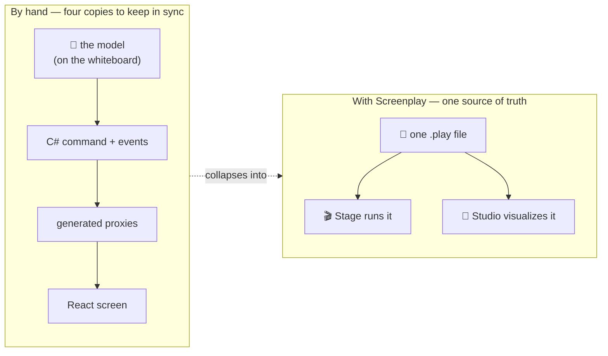

You already know what the feature is before you write a line of it. On the whiteboard there is a command, the events it produces, a read model those events project into, and a screen that shows the read model. The design is done. What remains is the part nobody enjoys: writing that same design out several more times, in several different places, and keeping every copy in step for the rest of the project's life.

## The friction: one model, written four times

A single "register an invoice" feature, built by hand, is spread across four artifacts that all describe the *same* thing:

- the **C# command** and its validation and authorization,
- the **events** it appends,
- the **projection and read model** that turn those events into queryable state,
- the **React screen** that renders it — through generated proxies that have to be regenerated whenever the backend shifts.

Nothing keeps them honest with each other. Rename a field on the event and the projection, the proxy, and the screen quietly fall out of sync until something breaks at runtime. The model in your head — the thing you actually reasoned about — exists nowhere as a single artifact. It has been shredded across layers.

## The relief: describe it once

A Screenplay `.play` file *is* that model, written down once:

```screenplay
slice StateChange RegisterInvoice
  command RegisterInvoice
    invoiceId     InvoiceId
    invoiceNumber InvoiceNumber
    authorize CanManageInvoice
    validate
      invoiceNumber matches "^INV-[0-9]{6}$"  message "Must look like INV-000000"
    produces InvoiceRegistered
      invoiceId     = invoiceId
      invoiceNumber = invoiceNumber
      registeredAt  = $context.occurred

  event InvoiceRegistered
    invoiceId     InvoiceId
    invoiceNumber InvoiceNumber
    registeredAt  DateTime
```

The command, its rules, and the fact it records sit together in one place, in the order you reasoned about them. There is no second copy to keep in sync, because there is no second copy. **Stage** interprets the `.play` file and runs it as a live application; **Studio** reads the same file to visualize and generate. The model and the running system are the same artifact, so they cannot drift.



## What makes it hold together

Three design choices keep the single file both complete and honest — they are covered in depth in the [language overview](overview.md):

- **Slices are the atom.** Every construct lives inside a typed slice aligned with Event Modeling's vocabulary, so the file's structure *is* the model's structure — not a technical layering of it.
- **Concepts carry compliance.** A value type declares `@pii` or `@sensitive` once, and every place that value appears inherits it. Compliance stops being a per-field decision you can forget.
- **Declarative first, with an escape hatch.** The common shape is terse and declarative, but any construct can drop into inline C#, TypeScript, React, or HTML — so the hard cases never force you out of the model.

## When a hand-written slice is the better fit

Screenplay is not always the right tool, and pretending otherwise would waste your time:

- **You are not building a Cratis event-sourced CQRS app.** Screenplay models Arc commands/queries and Chronicle events/projections. If your system isn't shaped that way, the language has nothing to describe. Start with [Why developers choose Cratis](/why-cratis/) first.
- **Almost every construct needs custom logic.** The escape hatch is there for the hard 10%. If a slice is 90% inline C#, the declarative wrapper is adding ceremony rather than removing it — write that slice by hand.
- **You need something the language can't yet express.** Screenplay is young and evolving. When a construct isn't covered, a hand-written slice alongside your `.play` files is a perfectly good answer — the two coexist because a `.play` file targets the very same Arc and Chronicle artifacts you would otherwise write yourself.

Convinced it fits? [Write your first `.play` file →](./getting-started.md)
