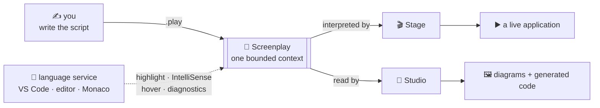

<div align="center">

# 🎬 Screenplay

**The modeling language for the Cratis platform — one declarative `.play` file describes a whole bounded context, and the cast performs it live.**

[](https://discord.gg/kt4AMpV8WV)
[](https://marketplace.visualstudio.com/items?itemName=cratis.screenplay)
[](https://github.com/Cratis/Screenplay/actions/workflows/publish.yml)
[](LICENSE)

</div>

---

A screenplay is the one document a production works from — it names the cast, sets every scene, and writes
every line, so the director, the actors, and the crew all put on the *same* show. That's the whole idea. A
Screenplay `.play` file is the script for a bounded context: its concepts, events, commands, queries,
projections, screens, automations, and the rules that govern them — top to bottom, in one place.

Hand that script to **Stage** and it puts on the performance — a live, running application. Hand it to
**Studio** and it storyboards the same script — visualizing and generating from it. One script; no meaning
lost between the model on the whiteboard and the app in production.

## 🎬 Why "Screenplay"?

Four reasons, and they all line up:

- **It's the script for the whole show.** A screenplay holds an entire production in one document — cast,
  scenes, stage directions, dialogue. A `.play` file holds an entire bounded context the same way: nothing
  about the behavior hides in another layer or another file.
- **It's written to be performed, not just read.** A screenplay isn't the finished film — it's the thing you
  perform. **Stage** reads it and runs the application; **Studio** reads it and draws it. The script is
  executable, not merely descriptive.
- **The `.play` extension wears it on its sleeve.** A screenplay is a play; the file is a `.play`.
- **The Cratis storytelling family.** Cratis names its products after telling a story: **Chronicle** records
  what happened, **Arc** shapes the plot, **Narrator**, **Lens**, **Studio**, **Prompter**… **Screenplay** is
  the script the whole cast performs from. It joins the ensemble.

## 🎭 What a scene looks like

A `.play` file reads top to bottom like a script — indentation-based, no braces, each construct owning
everything beneath it:

```screenplay
module Invoicing

  feature InvoiceManagement

    slice StateChange RegisterInvoice
      command RegisterInvoice
        invoiceId     InvoiceId
        invoiceNumber InvoiceNumber
        dueDate       Date

        authorize CanManageInvoice
        validate
          invoiceNumber matches "^INV-[0-9]{6}$"  message "Must look like INV-000000"
          dueDate > today                          message "Due date must be in the future"

        produces InvoiceRegistered
          invoiceId     = invoiceId
          invoiceNumber = invoiceNumber
          dueDate       = dueDate
          registeredAt  = $context.occurred

      event InvoiceRegistered
        invoiceId     InvoiceId
        invoiceNumber InvoiceNumber
        dueDate       Date
        registeredAt  DateTime

    slice StateView InvoiceList
      query ListInvoices => InvoiceListReadModel[]
      projection InvoiceList => InvoiceListReadModel
        from InvoiceRegistered key invoiceId
          invoiceNumber = invoiceNumber
          status        = "draft"
      screen InvoiceList
        data InvoiceListReadModel[] via query ListInvoices
        action RegisterInvoice
```

One slice, backend to screen: who's allowed in, what has to be true, the fact it records, and the list that
shows it — all in a single read. The second slice never touches a database or a controller; it declares how
events *project* into a read model and how that read model *appears* on screen.

## 📖 The whole production in one file

A `.play` describes a bounded context as a set of typed **slices**, aligned with Event Modeling's vocabulary.
Pick the slice type by what the slice *does*:

| Slice type | The scene it plays | Constructs |
| --- | --- | --- |
| `StateChange` | something changes the system | `command` → `event`, with `validate`, `authorize`, `constraint` |
| `StateView` | something reads the system | `query` + `projection` + `screen` |
| `Automation` | something reacts to what happened | `reactor` |
| `Translate` | something turns outside data into events | `capture` |

Three ideas keep the script both readable and complete:

- **Declarative first, with an escape hatch.** Every construct has a clean declarative form — but any of them
  can drop into inline **C#**, **TypeScript**, **React**, or **HTML** (or a `file` reference) when a scene
  needs custom staging. Common cases stay terse; the hard 10% is never out of reach.
- **Concepts carry compliance.** Value types declare their attributes once — `@pii`, `@sensitive` — and every
  usage inherits them, so GDPR and sensitivity travel with the data instead of being re-litigated per field.
- **Pluggable sub-languages.** Projections are written in the **Projection Declaration Language (PDL)** and
  captures in the **Change Data Capture Language (CDL)** — embedded sub-grammars parsed inside their
  constructs. They're the reference implementations of a registry you can extend with sub-languages of your
  own.

The full construct reference and the complete EBNF grammar live in
[`Documentation/screenplay`](Documentation/screenplay/index.md).

## 🎥 One script, two performances

The `.play` file is the single source of truth. The tooling in *this repo* is the writing room — it makes the
script a joy to author — and downstream, Stage and Studio each read the very same file:



Because the model and the app are the same artifact, there's no drift to reconcile: change the script, and
the performance changes with it.

## 🧰 What's in this repo

Screenplay lives here — the language definition, its documentation, and the tools that make writing `.play`
files pleasant:

| Piece | What it is | Where |
| --- | --- | --- |
| **Language & grammar** | The language reference for every construct and the full EBNF grammar | [`Documentation/screenplay`](Documentation/screenplay/index.md) |
| **`@cratis/screenplay-language`** | Monaco language service — highlighting (incl. embedded C#/TS/React/HTML and PDL/CDL), IntelliSense, hover, diagnostics | [`Source/Screenplay/Monaco/screenplay-language`](Source/Screenplay/Monaco/screenplay-language) |
| **`screenplay-editor`** | A standalone editor host for writing `.play` files right in the browser | [`Source/Screenplay/Monaco/screenplay-editor`](Source/Screenplay/Monaco/screenplay-editor) |
| **`screenplay` (VS Code extension)** | The same language support in VS Code — `.play` files even get the Cratis icon | [`Source/Screenplay/VSCodeExtension`](Source/Screenplay/VSCodeExtension) |

## 🚀 Quick start

```shell
yarn install
yarn build
yarn dev      # opens the standalone editor on http://localhost:9200
```

Prefer to write in your own editor? Press **F5** in VS Code — it builds the language service and the extension
and launches an Extension Development Host with full `.play` support, ready to try on a sample from
[`screenplay-editor/samples`](Source/Screenplay/Monaco/screenplay-editor/samples).

## 🗺️ Start here (for contributors)

- [`Documentation/screenplay`](Documentation/screenplay/index.md) — the language overview, design principles, and top-level structure. **Start here to learn the language.**
- [`Documentation/screenplay/slices.md`](Documentation/screenplay/slices.md) — modules, features, and the four slice types.
- [`Documentation/screenplay/grammar.md`](Documentation/screenplay/grammar.md) — the complete EBNF grammar.
- [`Documentation/screenplay/sub-languages.md`](Documentation/screenplay/sub-languages.md) — how PDL, CDL, and your own sub-languages plug in.
- [`Source/Screenplay/Monaco/screenplay-language/README.md`](Source/Screenplay/Monaco/screenplay-language/README.md) — embedding the language service in a Monaco editor.

## ✅ Quality gates

```shell
yarn build     # every workspace builds clean
yarn lint      # zero lint errors
yarn compile   # zero TypeScript errors
```

---

<div align="center">

*Part of the [Cratis](https://cratis.io) platform · Licensed under the [MIT license](LICENSE)*

</div>
