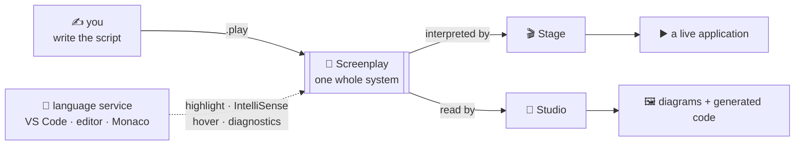

<div align="center">

# 🎬 Screenplay

**A business-oriented declarative language for specifying the desired functionality of an information system.**

[](https://discord.gg/kt4AMpV8WV)
[](https://marketplace.visualstudio.com/items?itemName=cratis.screenplay)
[](https://github.com/Cratis/Screenplay/actions/workflows/publish.yml)
[](LICENSE)

</div>

---

A screenplay is the one document a production works from — it names the cast, sets every scene, and writes
every line, so the director, the actors, and the crew all put on the *same* show. That's the whole idea. A
Screenplay `.play` file is the script for an information system: its concepts, events, commands, queries,
projections, specifications, automations, and the rules that govern them — top to bottom, in one place.

Screenplay owns that language and its portable meaning; it does not prescribe the runtime. It is a
model-first language for event-sourced, CQRS systems — commands, events, projections, and the screens they
feed — and it is part of the experimental Cratis model-first layer. Downstream tools can interpret the same
model: [**Stage**](https://github.com/Cratis/Stage) is being built to render it into a running
[Cratis Arc](https://github.com/Cratis/Arc) + [Chronicle](https://github.com/Cratis/Chronicle) application,
while [**Studio**](https://github.com/Cratis/Studio) visualizes and edits it. The goal is one script with
explicit capability checks, not a claim that every downstream surface already performs every construct.

## 🎬 Why "Screenplay"?

Four reasons, and they all line up:

- **It's the script for the whole show.** A screenplay holds an entire production in one document — cast,
  scenes, stage directions, dialogue. A `.play` file holds an entire system the same way: nothing
  about the behavior hides in another layer or another file.
- **It's written to be performed, not just read.** A screenplay isn't the finished film — it's the thing you
  perform. Screenplay now owns the versioned semantic foundation that runtimes and renderers are being
  migrated to consume. The language is moving from descriptive syntax to verifiable execution without
  making one runtime authoritative.
- **The `.play` extension wears it on its sleeve.** A screenplay is a play; the file is a `.play`.
- **The Cratis storytelling family.** Cratis names its products after telling a story: **Chronicle** records
  what happened, **Arc** shapes the plot, **Narrator**, **Lens**, **Studio**, **Prompter**… **Screenplay** is
  the script the whole cast performs from. It joins the ensemble.

## 🎭 What a scene looks like

A `.play` file reads top to bottom like a script — indentation-based, no braces, each construct owning
everything beneath it:

```screenplay
module Invoicing

  feature InvoiceManagement

    slice StateChange RegisterInvoice
      command RegisterInvoice
        invoiceId     InvoiceId
        invoiceNumber InvoiceNumber
        dueDate       Date

        authorize CanManageInvoice
        validate
          invoiceNumber matches "^INV-[0-9]{6}$"  message "Must look like INV-000000"
          dueDate > today                          message "Due date must be in the future"

        produces InvoiceRegistered
          invoiceId     = invoiceId
          invoiceNumber = invoiceNumber
          dueDate       = dueDate
          registeredAt  = $context.occurred

      event InvoiceRegistered
        invoiceId     InvoiceId
        invoiceNumber InvoiceNumber
        dueDate       Date
        registeredAt  DateTime

    slice StateView InvoiceList
      query ListInvoices => InvoiceListReadModel[]
      projection InvoiceList => InvoiceListReadModel
        from InvoiceRegistered key invoiceId
          invoiceNumber = invoiceNumber
          status        = "draft"
      screen InvoiceList
        data InvoiceListReadModel[] via query ListInvoices
        action RegisterInvoice
```

One slice, backend to screen: who's allowed in, what has to be true, the fact it records, and the list that
shows it — all in a single read. The second slice never touches a database or a controller; it declares how
events *project* into a read model and how that read model *appears* on screen.

## 📖 The whole production in one file

A `.play` describes an entire system as a set of typed **slices**, aligned with Event Modeling's vocabulary.
Pick the slice type by what the slice *does*:

| Slice type | The scene it plays | Constructs |
| --- | --- | --- |
| `StateChange` | something changes the system | `command` → `event` via `produces` or an imperative `handler`, with `validate`, `authorize`, `constraint` |
| `StateView` | something reads the system | `query` + `projection` + `screen` |
| `Automation` | something runs when something happens | `reaction` |
| `Translate` | something turns outside data into events | `capture` |

Three ideas keep the script both readable and complete:

- **Declarative first, with bounded escape hatches.** The behavior remains meaningful without implementation
  files. Selected implementation points — such as a command handler, query performer, or rule predicate —
  can carry inline code or a `file` reference. These bodies are realization attachments, not a second
  application model, and the language is evolving toward typed, capability-limited contexts.
- **Concepts carry compliance.** Value types declare their attributes once — `@pii`, `@sensitive` — and every
  usage inherits them, so GDPR and sensitivity travel with the data instead of being re-litigated per field.
- **First-class sub-languages.** Projections use the **Projection Declaration Language (PDL)** and captures
  use the **Change Data Capture Language (CDL)**. Both are independently consumable built-in grammars.
  Inline language tags are extensible and carried as opaque text; host-language construct keywords remain
  closed so the compiler never silently discards an unknown behavior.

The full construct reference and the complete EBNF grammar live in
[`Documentation/screenplay`](Documentation/screenplay/index).

## 🎥 One script, two performances

The `.play` file is the single source of truth. The tooling in *this repo* is the writing room — it makes the
script a joy to author — and downstream, Stage and Studio each read the very same file:


```mermaid
flowchart LR
    Author["✍️ you<br/>write the script"] -->|".play"| Play[["📄 Screenplay<br/>one whole system"]]
    Tools["🧰 language service<br/>VS Code · editor · Monaco"] -.->|"highlight · IntelliSense<br/>hover · diagnostics"| Play
    Play -->|"interpreted by"| Stage["🎬 Stage"]
    Play -->|"read by"| Studio["🎨 Studio"]
    Stage --> App["▶️ a live application"]
    Studio --> Viz["🖼️ diagrams + generated code"]
```

The intended contract is simple: change the semantic model and every conforming performance changes with it.
Until a runtime declares and passes that capability, it must fail closed rather than silently omit or weaken
what the script says.

## 🧰 What's in this repo

Screenplay lives here — the language definition, its documentation, and the tools that make writing `.play`
files pleasant:

| Piece | What it is | Where |
| --- | --- | --- |
| **Language & grammar** | The language reference for every construct and the full EBNF grammar | [`Documentation/screenplay`](Documentation/screenplay/index) |
| **`Cratis.Screenplay`** | The .NET compiler — parsing, the shared syntax tree, [visitors and tree traversal](Documentation/screenplay/visitors.md), diagnostics, file/folder compilation, and the versioned executable semantic model foundation | [`Source/DotNET/Screenplay`](Source/DotNET/Screenplay) |
| **`Cratis.Screenplay.Tool`** | The `screenplay` CLI (a dotnet tool) — verifies every `.play` file in a directory tree | [`Source/DotNET/Tool`](Source/DotNET/Tool) |
| **`@cratis/screenplay-language`** | Monaco language service — highlighting (incl. embedded C#/TS/React/HTML and PDL/CDL), IntelliSense, hover, diagnostics | [`Source/Screenplay/Monaco/screenplay-language`](Source/Screenplay/Monaco/screenplay-language) |
| **`screenplay-editor`** | A standalone editor host for writing `.play` files right in the browser | [`Source/Screenplay/Monaco/screenplay-editor`](Source/Screenplay/Monaco/screenplay-editor) |
| **`screenplay` (VS Code extension)** | The same language support in VS Code — `.play` files even get the Cratis icon | [`Source/Screenplay/VSCodeExtension`](Source/Screenplay/VSCodeExtension) |

## 🛠️ Compile and verify `.play` files

The compiler ships on NuGet. Install the CLI as a global dotnet tool and run it from the root of any
project — it finds every file matching `**/*.play`, compiles them, and prints any problems compiler-style
with the offending line and a caret:

```shell
dotnet tool install -g Cratis.Screenplay.Tool
screenplay            # or: screenplay path/to/screenplays
```

Embedding the compiler in your own tooling is one package away — see
[Compiler and CLI](Documentation/screenplay/tool.md):

```shell
dotnet add package Cratis.Screenplay
```

## 🚀 Quick start

```shell
yarn install
yarn build
yarn dev      # opens the standalone editor on http://localhost:9200
```

Prefer to write in your own editor? Press **F5** in VS Code — it builds the language service and the extension
and launches an Extension Development Host with full `.play` support, ready to try on a sample from
[`screenplay-editor/samples`](Source/Screenplay/Monaco/screenplay-editor/samples).

## 🗺️ Start here (for contributors)

- [`Documentation/screenplay`](Documentation/screenplay/index) — the language overview, design principles, and top-level structure. **Start here to learn the language.**
- [`Documentation/screenplay/slices.md`](Documentation/screenplay/slices.md) — modules, features, and the four slice types.
- [`Documentation/screenplay/grammar.md`](Documentation/screenplay/grammar.md) — the complete EBNF grammar.
- [`Documentation/screenplay/sub-languages.md`](Documentation/screenplay/sub-languages.md) — how PDL, CDL, and your own sub-languages plug in.
- [`Source/Screenplay/Monaco/screenplay-language/README.md`](Source/Screenplay/Monaco/screenplay-language/README.md) — embedding the language service in a Monaco editor.

## ✅ Quality gates

```shell
yarn build     # every workspace builds clean
yarn lint      # zero lint errors
yarn compile   # zero TypeScript errors

dotnet build Screenplay.slnx --configuration Release   # zero errors, zero warnings
dotnet test Screenplay.slnx                            # all specs pass
```

## The Cratis ecosystem

This project is part of [Cratis](https://www.cratis.io) — free, MIT-licensed tools for building event-sourced and CQRS applications.

- **[Chronicle](https://github.com/Cratis/Chronicle)** — event-sourcing database and runtime. Orleans-based kernel, pluggable storage (MongoDB default; PostgreSQL, SQL Server, SQLite, in-memory), language-agnostic gRPC contracts. [Docs](https://www.cratis.io/chronicle/)
- **Chronicle clients** — first-class [.NET SDK](https://github.com/Cratis/Chronicle), plus [TypeScript](https://github.com/Cratis/Chronicle.TypeScript), [Kotlin/Java](https://github.com/Cratis/Chronicle.Kotlin), and [Elixir](https://github.com/Cratis/Chronicle.Elixir); [Python](https://github.com/Cratis/Chronicle.Python) coming soon (pre-alpha). AI agents connect through the [Chronicle MCP server](https://github.com/Cratis/Chronicle.Mcp).
- **[Arc](https://github.com/Cratis/Arc)** — opinionated CQRS framework for ASP.NET Core with commands, queries, validation, authorization, and TypeScript proxy generation. Works without event sourcing. [Docs](https://www.cratis.io/arc/)
- **[Components](https://github.com/Cratis/Components)** — React components aligned with Arc patterns. [Docs](https://www.cratis.io/components/)
- **[CLI](https://github.com/Cratis/cli) + Workbench** — inspect and diagnose Chronicle from the terminal or the browser. [Docs](https://www.cratis.io/cli/)
- **Model-first layer (experimental)** — [Studio](https://github.com/Cratis/Studio), Screenplay (this repository), [Stage](https://github.com/Cratis/Stage), [Scene](https://github.com/Cratis/Scene), [Prologue](https://github.com/Cratis/Prologue)
- **Supporting** — [Fundamentals](https://github.com/Cratis/Fundamentals), [Specifications](https://github.com/Cratis/Specifications), [Synopsis](https://github.com/Cratis/Synopsis), [Lens](https://github.com/Cratis/Lens), and [Narrator](https://github.com/Cratis/Narrator)
- **[Samples](https://github.com/Cratis/Samples)** — runnable event sourcing and CQRS samples for the whole stack

Everything Cratis publishes today is MIT licensed and free to use.

---

<div align="center">

*Part of the [Cratis](https://cratis.io) platform · Licensed under the [MIT license](LICENSE)*

</div>
